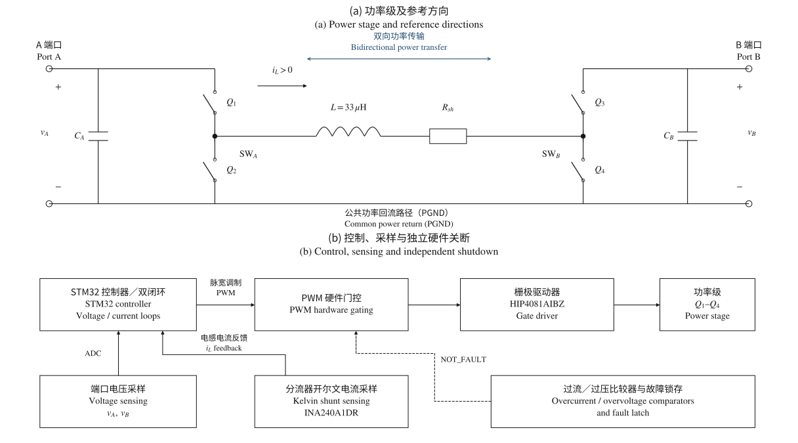
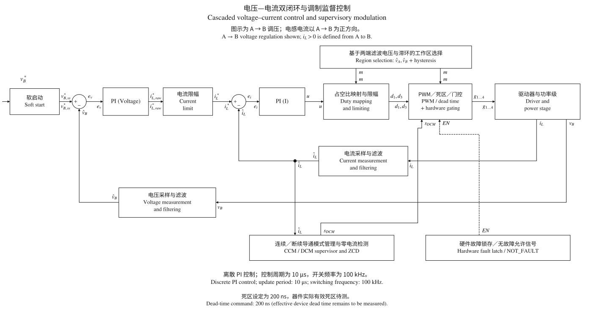
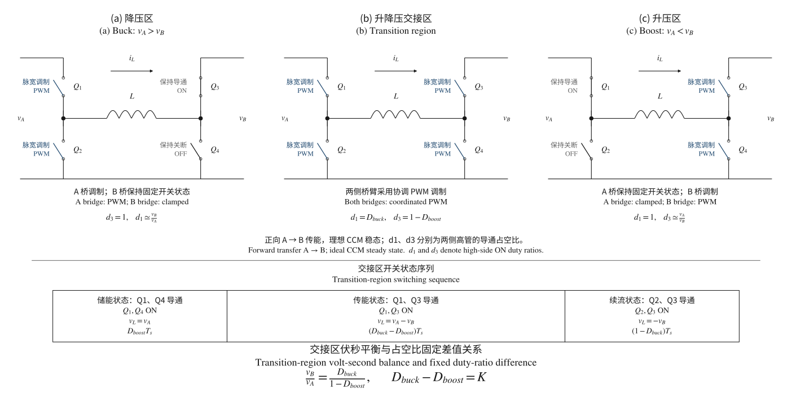

# 100 W Bidirectional Four-Switch Buck-Boost Converter Design

  

  
  

[中文](README.md) | **English**

## Project Status
🟢 Parameter Design 
🟢 Topology & Control Strategy Design 
🟢 Component Selection 
🟢 Schematic Design 
🟢 PSIM Simulation Verification 
🟢 PCB Design 
🟢 PCB Fabrication 
🟢 PCB Received 
🟢 BOM Procurement 
🟡 Awaiting SMT Assembly 
⚪ First Power-Up 
⚪ Hardware Debugging 
⚪ Control Firmware Integration 
⚪ Hardware Performance Testing 
⚪ Final Testing & Project Summary

This project is partially open-source and is mainly intended to showcase my design process, engineering approach, and implementation methodology.

If you are interested in this project or would like to discuss the design concepts, schematic files, PCB files, BOM, or other related details, feel free to contact me at: [junkangzhang@qq.com](mailto:junkangzhang@qq.com)

I’d be happy to exchange ideas with you and discuss ways to further improve the design.

## 1 Project Background

This project originally came from another project of mine—a microgrid.

In the microgrid project, I designed a flywheel energy storage system, FESS (Flywheel Energy Storage System), and a battery energy storage system, BESS (Battery Energy Storage System). Both storage systems connect to the inverter's common DC bus.

Bidirectional energy exchange between the storage systems and the grid enables charging and discharging, and further supports peak shaving, power balancing, and power quality regulation.

While designing the BESS, I needed a DC-DC converter supporting bidirectional power flow so that the storage unit could charge and discharge through the inverter DC bus. To turn this system-level requirement into hardware that I could actually build and debug, I chose the four-switch bidirectional buck-boost power topology for this project.

This became the starting point for the project.

### 1.1 Power Rating and Implementation Scope

My microgrid design and simulation work is mainly carried out in MATLAB/Simulink.

In the original microgrid model, the inverter DC bus voltage reaches approximately 1200 V, and the BESS power rating reaches approximately 50 kW.

Directly designing a physical bidirectional DC-DC converter at this voltage and power level would not be suitable for a personal hardware project, whether in terms of safety, cost, component selection, or my available experimental facilities.

I therefore extracted the bidirectional buck-boost topology from the microgrid system, kept that topology unchanged, and used it as the basis for the hardware design.

Although I deliberately reduced the voltage and power ratings, the engineering complexity remains. In this project, I retained bidirectional power flow and the two basic buck and boost operating modes, while also considering CCM at rated load and DCM at light load.

The controller uses an outer voltage loop and an inner current loop. The power-stage work covers MOSFETs, the inductor, and capacitors, through to gate drive and bidirectional current sensing. Beyond component selection itself, it also involves hardware protection against overcurrent and overvoltage, as well as the ringing and parasitic effects that inevitably arise during actual switching.

At the PCB stage, I focused on the layout and return paths of the high-current power loops, gate-drive loops, and Kelvin sensing loops.

Therefore, although the overall power is only around 100 W, most of the complete power electronics design process has been retained: topology, control, component selection, protection, PCB design, simulation, and subsequent hardware experiments.

## 2 Design Specifications

The basic design specifications are as follows:

| **Parameter** | **Design value** |
|---|---|
| Topology | Four-switch synchronous, non-isolated, bidirectional buck-boost |
| Rated power | 100 W |
| Port A voltage | 18–30 V |
| Port B voltage | 24 V nominal control operating point |
| Power direction | Bidirectional |
| Switching frequency | 100 kHz |
| Design current ripple ratio | r = 0.4 |
| Rated-load operation | CCM |
| Light-load operation | DCM (control strategy still being optimized) |
| Target efficiency | 98.5% (design target, pending measurement) |
| Output voltage ripple target | ≤0.5% (first-board target; 0.1% is a stretch target) |

The 24 V at port B is the nominal operating point for the current control design and simulations. The four-switch bidirectional buck-boost topology allows both ports A and B to act as input or output within the component ratings, protection thresholds, and control range. In this project, port B is fixed at 24 V mainly to represent operation on the side connected to a 24 V battery or a low-voltage DC bus.

## 3 Power Stage Design

Figure 1 Four-switch bidirectional buck-boost power stage and control, sensing, and protection architecture

The upper panel shows the two half bridges, the 33 µH main inductor, and the series current shunt. Inductor current is defined as positive from A to B. The lower panel separates the STM32 control loops, PWM hardware gating, HIP4081AIBZ gate driver, and voltage and current sensing. Overcurrent and overvoltage comparators feed the fault latch and hardware shutdown path without waiting for a software-loop response.

### 3.1 Main Power Inductor Design

The main inductor is initially designed using the current ripple ratio

$$
r = \frac{\Delta I_{L}}{I_{L,avg}} = 0.4
$$

Since this is a bidirectional buck-boost converter, both bridge A and bridge B can serve as the input or output. The design therefore needs to be checked under different input/output conditions, primarily 18 V → 24 V, 30 V → 24 V, 24 V → 18 V, and 24 V → 30 V.

The switching frequency is set to 100 kHz as a compromise between magnetic component size, switching losses, control bandwidth, and EMI, corresponding to a switching period of 10 µs. The design ripple is set to 40% of average inductor current, and the inductor volt-second product and required inductance are then calculated for each of the four boundary conditions.

The results for the four conditions are as follows: at 18 V → 24 V, the inductor volt-second product is approximately 45 V·µs, corresponding to a theoretical inductance of approximately 20.25 µH; at 30 V → 24 V, it is approximately 48 V·µs, corresponding to 28.8 µH. The reverse conditions, 24 V → 18 V and 24 V → 30 V, also give 20.25 µH and 28.8 µH respectively. In other words, among these boundary points, 30 V → 24 V and 24 V → 30 V require the highest inductance, so the theoretical lower limit is approximately 28.8 µH.

Taking 18 V → 24 V as an example, the ideal duty cycle in boost operation is

$$
D = 1 - \frac{18}{24} = 0.25
$$

The inductor volt-second product within one cycle is

$$
18 \times 0.25 \times 10 = 45\text{~V} \cdot \mu s
$$

At 100 W, the average current on the 18 V side is approximately

$$
I_{L} = \frac{100}{18} \approx 5.56\text{~}A
$$

If the design uses 40% current ripple, then

$$
\Delta I_{L} \approx 0.4 \times 5.56 = 2.22\text{~}A
$$

The required inductance is therefore approximately

$$
L = \frac{45}{2.22} \approx 20.25\text{~}\mu H
$$

The highest lower limit obtained from the theoretical calculations is 28.8 µH. Considering manufacturing tolerance and the reduction in effective inductance caused by temperature rise and DC bias, I did not select right at the theoretical limit. Instead, I chose a commercially available 33 µH inductor and continued checking saturation current, temperature-rise current rating, DCR, and core losses.

#### 3.1.1 Ripple Check with 33 µH

Under the 45 V·µs condition:

$$
\Delta I_{L} = \frac{45}{33} \approx 1.36\text{~A}
$$

Under the 48 V·µs condition:

$$
\Delta I_{L} = \frac{48}{33} \approx 1.45\text{~A}
$$

Therefore, the 33 µH inductor still provides some design margin over the theoretical minimum.

Actual selection also requires checking DCR, effective inductance under DC bias, saturation current, RMS current capability, core losses, and temperature rise at 100 kHz. Thus, 33 µH was not chosen solely from the nominal inductance; it balances current capability, losses, temperature rise, and component size.

Based on this, I want the selected inductor to meet at least the following conditions:

| **Parameter** | **Target** |
|---|---|
| Nominal inductance | 33 µH |
| Effective inductance at high current | Keep as close as possible to 28.8 µH or above |
| Saturation current | ≥10 A |
| Temperature-rise current rating | ≥8 A |
| DCR | <15 mΩ |
| Construction | Shielded inductor |

Low DCR helps reduce inductor copper losses:

$$
P_{Cu} = I_{L,RMS}^{2}R_{DCR}
$$

Using a shielded inductor also reduces the EMI impact of the main inductor's magnetic field on current detection and control signals on the board.

### 3.2 Capacitor Design

The preliminary output-capacitor check uses 18 V → 24 V boost operation as the boundary condition. Among the current four nominal boundary conditions, this places the highest capacitance requirement on the 24 V side's output capacitors.

The duty cycle in boost mode is:

$$
D = 1 - \frac{V_{in}}{V_{o}}
$$

Substituting:

$$
D = 1 - \frac{18}{24} = 0.25
$$

At 100 W output power:

$$
I_{o} = \frac{100}{24} \approx 4.17\text{~A}
$$

Ignoring ESR and ESL, the boost output capacitance can be calculated using:

$$
C_{\min} = \frac{I_{o}D}{f_{s}\Delta V_{o}}
$$

for a preliminary estimate.

First, an idealized calculation uses 0.1% of the 24 V output voltage as a stretch target:

$$
\Delta V_{o} = 24 \times 0.1\% = 0.024\text{~V}
$$

Therefore:

$$
C_{\min} = \frac{4.17 \times 0.25}{100000 \times 0.024} \approx 434\text{~}\mu F
$$

The theoretical minimum is therefore approximately:

$$
C_{\min} \approx 434\text{~}\mu F
$$

The calculation above ignores ESR, ESL, manufacturing tolerance, temperature, and the reduction of MLCC capacitance under DC bias, so it can only serve as a lower bound for nominal capacitance. Actual operation also includes transients such as startup, load steps, and port connection or disconnection. Final ripple must therefore be assessed together with component impedance curves, PCB parasitics, and measured waveforms.

Both sides ultimately use 2 × 220 µF / 50 V aluminum electrolytic capacitors, with a 10 µF / 50 V X7R capacitor, a 10 µF ceramic capacitor, and a 100 nF high-frequency ceramic capacitor in parallel. The larger capacitors mainly support low-frequency and transient demands, while the smaller capacitors reduce high-frequency impedance.

The nominal capacitance of 2 × 220 µF is only slightly above the ideal 434 µF lower limit. The first board uses ≤0.5% as the acceptance target, with 0.1% retained as a direction for later optimization.

The capacitor bank's ripple current capability also needs to satisfy

$$
I_{ripple,rated} > 3\text{~A}
$$

The ripple caused by ESR must also be included:

$$
\Delta V_{ESR} \approx \Delta I_{C} \cdot ESR
$$

### 3.3 MOSFET Selection and Losses

Total MOSFET losses can be roughly expressed as:

$$
P_{MOSFET} \approx P_{cond} + P_{sw} + P_{oss} + P_{rr}
$$

Main power MOSFET selection considers voltage rating, RDS(on), conduction losses, switching losses, gate-drive losses, output capacitance losses, reverse recovery, thermal performance, and safe operating area (SOA).

#### 3.3.1 Conduction Losses

MOSFET conduction losses can be approximated as:

$$
P_{cond} = I_{RMS}^{2}R_{DS(on)}
$$

The actual design must also account for the increase in RDS(on) as temperature rises.

#### 3.3.2 Switching Losses

MOSFET switching losses can use a first-order approximation:

$$
P_{sw} \approx \frac{1}{2}V_{DS}I_{D}\left( t_{r} + t_{f} \right)f_{s}
$$

At a switching frequency of 100 kHz, MOSFET switching time, gate charge, and junction capacitance already have a significant effect on losses.

Faster switching is not always better. Faster edges shorten the switching process and reduce some switching losses, but they also amplify the effects of PCB parasitic inductance and capacitance. Excessively high rates of change of voltage and current can produce voltage spikes, current spikes, and switching ringing, making EMI control more difficult.

#### 3.3.3 Gate Charge

Gate-drive power can be approximated as:

$$
P_{gate} = Q_{g}V_{GS}f_{s}
$$

This portion is mainly included in the gate-driver power budget.

In addition to total gate charge Qg, I found that Qgd is closely related to the Miller interval. It affects the MOSFET's VDS transition speed and actual switching time, which in turn affects switching losses and the driver's required current capability.

#### 3.3.4 Output Capacitance Losses

The MOSFET's output capacitance also participates in every switching event.

$$
P_{oss} \approx \frac{1}{2}C_{oss}V_{DS}^{2}f_{s}
$$

However, the actual Coss is not constant; it changes significantly with VDS. I therefore look for the Eoss data provided in the datasheet and calculate using Poss ≈ Eossfs, which more closely represents the MOSFET's actual switching process.

#### 3.3.5 Reverse Recovery

During dead time in a synchronous buck-boost converter, inductor current still needs a freewheeling path, and a MOSFET body diode may briefly conduct. When the other MOSFET turns on again, the charge stored in the body diode must first be removed, so reverse recovery charge Qrr also directly participates in the switching process.

If Qrr is large, a more pronounced reverse recovery current spike appears during commutation. This not only increases switching losses but also further excites parasitic effects in the power loop, resulting in more severe ringing, transient MOSFET stress, and EMI.

Therefore, my final MOSFET selection did not look only at RDS(on). I compared VDS, RDS(on), Qg, Ciss, Coss, and Qrr together, while also checking pulse current capability, SOA, thermal performance, and the package's own parasitics. Many of these parameters involve trade-offs. For example, very low on-resistance often comes with higher gate charge and junction capacitance, so the final decision still has to take this board's voltage, power, and 100 kHz switching frequency into account.

### 3.4 MOSFET Voltage Rating

The main power MOSFETs were not selected right at the 30 V steady-state upper limit; instead, I used 60 V devices. This provides steady-state voltage margin relative to the normal 18–30 V range. However, early PSIM mode transitions produced transients of 40–50 V or even higher. VDS overshoot needs to be measured on the actual board, and the peaks kept within a reliable range through layout, gate resistance, and RC snubbers.

I ultimately selected:

$$
\boxed{\text{CSD18540Q5B}}
$$

for the four main power N-channel MOSFETs.

### 3.5 Switching Ringing and RC Snubbers

For switching ringing, I did not intend to fix the component values at the schematic stage, because ringing is determined by more than the MOSFET itself. Power-loop parasitic inductance, device packages, capacitor ESL, gate resistance, and actual operating current all play a part. Many of these are difficult to calculate accurately before the board is built, so I reserved RC snubber footprints near all four MOSFETs, using 2010 resistors and 0802 capacitors. All are initially DNP on the first board.

Once the board arrives, I will directly measure the MOSFET VDS waveforms to examine the actual overshoot amplitude, ringing frequency, and decay rate, while also checking for significant changes under different loads and buck or boost conditions. The final Rsnub and Csnub will then be determined from these measurements.

RC snubbers introduce additional losses, usually dominated by the capacitor's charging and discharging energy each cycle, while the resistor mainly determines damping and peak current. The resistor and capacitor values are tuned together based on the measured ringing frequency and decay. The order of magnitude of the losses can be estimated initially using:

$$
P_{snub} \sim CV^{2}f_{s}
$$

## 4 Gate Drive and Current Sensing

After settling on the MOSFETs, the next task was driving the four N-channel devices. My initial requirements were fairly simple: a gate-drive voltage of approximately 10–12 V, the ability to drive all four MOSFETs in two half-bridges, proper high-side operation, and consideration of high duty cycles, dead time, and sufficient gate source/sink current capability.

### 4.1 Initial Selection of MP6528

I initially selected the MP6528. It is designed to drive four N-channel MOSFETs in two half-bridges, which closely matches the power-stage structure of a four-switch buck-boost converter.

At the time, I valued its built-in VREG of approximately 11.5 V. This allows the gate-drive supply to be provided internally without a separate 12 V drive supply, while a VGS of approximately 10–12 V also suits the CSD18540Q5B. The high-side driver also has an auxiliary charging mechanism that is more favorable for high-duty-cycle operation, and dead time can be adjusted using external components.

### 4.2 Changing to HIP4081AIBZ

Later, I found that the issue was not just “can it drive four MOSFETs?”

A four-switch buck-boost converter does not always operate as a fixed H-bridge under different voltage relationships. Here, I need to switch between buck, boost, and the buck-boost transition region, while also considering bidirectional power flow, CCM/DCM, and the relationship between the duty cycles of the two bridge legs. In some operating conditions, one side uses high-frequency PWM while the other remains synchronously on; in the transition region, both sides may participate in modulation.

At this point, it is no longer appropriate to leave the states of Q1, Q2, Q3, and Q4 entirely to a driver with extensive internal logic. I want the controller to have more freedom to decide how and when the four MOSFETs turn on, while the driver IC mainly converts logic signals into sufficiently strong gate drive.

The MP6528 itself integrates substantial H-bridge control and protection logic. These functions are convenient for a conventional H-bridge, but they affected my control flexibility in this four-switch buck-boost design.

I therefore later changed the driver to the **HIP4081AIBZ**. It can still provide high-side and low-side drive for four N-channel MOSFETs in two half-bridges, but its four control inputs are more direct. This leaves more of the specific switching-state decisions for buck, boost, the transition region, and bidirectional operation to the external controller.

### 4.3 Dead Time Design

Dead time must be provided between the upper and lower MOSFETs of the same bridge leg to prevent shoot-through caused by one device turning on before the other has turned off. The HIP4081AIBZ allows turn-on delays to be set using external resistors on HDEL and LDEL. In this design, hardware provides a base delay, while the main 200 ns dead time is generated by the STM32. This value is currently a design setting; the final effective dead time must be confirmed by separately measuring the upper and lower MOSFET VGS on the actual board.

### 4.4 Current Shunt and Kelvin Sensing

Because closed-loop current control will be implemented later, the accuracy of inductor-current sensing is very important here. If an ordinary two-terminal shunt resistor is used directly, the voltage drop produced by high current through the pads and PCB copper may also be included in the measurement, so the measured voltage would not be entirely the voltage drop across the shunt itself.

I therefore selected a current shunt with a four-pad structure for direct Kelvin sensing. The power current flows through the Force terminals, while the Sense terminals separately bring out the voltage from the two ends of the shunt body, minimizing the inclusion of high-current copper and pad contact resistance in the measurement.

Ideally, the sensing relationship is simply Ohm's law: Vshunt = ILRshunt.

This can improve sensing-signal integrity and accuracy and also clarify the PCB current paths: the main current flows along the power path, while the two Kelvin Sense traces run from independent sensing points to the current-sense amplifier without sharing pickup locations with the power copper.

### 4.5 Bidirectional Current Sensing

Because the converter supports bidirectional power flow, current sensing must determine direction as well as magnitude. I selected the **INA240A1DR**, using a reference voltage to shift the zero-current point to the midpoint. The MCU determines current direction from whether the output voltage is above or below the reference value.

This signal is mainly used for the inner current loop, DCM detection, and overcurrent protection.

## 5 Hardware Protection

I did not leave all protection on this board to the MCU. For faults such as overcurrent and overvoltage, I want the hardware to shut down the power stage before the software has time to respond, so I added an independent hardware protection path.

### 5.1 Reverse-Polarity Protection

Both ports A and B may connect to external power supplies or batteries, so I provided reverse-polarity protection at both ports. This uses the **LM74502 with external N-channel MOSFETs**.

Another important reason for selecting the LM74502 is that it handles input reverse-polarity protection without blocking reverse current during normal operation, so it does not conflict with the bidirectional power flow of the bidirectional buck-boost converter itself.

In other words, this section should remain conducting with minimal loss under normal wiring; if the port polarity is actually reversed, it isolates the incorrect voltage from the power stage.

### 5.2 Bidirectional Overcurrent Protection

Because power can flow in both directions, overcurrent protection cannot monitor only one direction. The INA240 output uses the reference voltage as the zero-current point, with forward and reverse currents corresponding to the two sides of that reference voltage. I therefore added separate forward and reverse hardware overcurrent thresholds.

The current design has protection thresholds of approximately **±8.4 A**. Normal closed-loop current control is still handled by the MCU, but once the current actually exceeds the hardware protection range, the circuit enters the fault logic and blocks gate drive directly, without waiting for a software decision.

This separates the responsibilities: the current loop “controls the current,” while the hardware comparators provide “protection.”

### 5.3 Overvoltage Protection

Both ports A and B also have voltage monitoring and hardware overvoltage protection. The maximum normal operating voltage is approximately 30 V, so the protection thresholds are placed outside the normal operating range. They must neither cause frequent false triggers from ordinary ripple and brief switching spikes nor be so high that protection becomes ineffective.

Overvoltage detection does not rely solely on the MCU ADC; independent comparator channels are retained. Once a monitored signal meets a comparator's triggering conditions, the fault signal directly enters the latch and gating logic to shut down the power stage. Actual spike immunity is jointly determined by the voltage divider, filtering, hysteresis, and comparator propagation delay.

### 5.4 Fault Shutdown and Latching

The overcurrent and overvoltage signals are not simply sent to the MCU and left there. I added a hardware fault latch, mainly because a fault may occur for such a brief instant that its signal disappears before the MCU samples it or the software enters its handling routine.

Forward and reverse overcurrent are first combined into FAULT_OC, while overvoltage on sides A and B is combined into FAULT_OV. These are then combined into FAULT_SET. The latch uses a **74LVC2G02 dual NOR gate** to form an SR latch. Once FAULT_SET is triggered, NOT_FAULT immediately goes low, and the fault state does not clear by itself even if the original overcurrent or overvoltage disappears.

NOT_FAULT then participates in driver enable and hardware PWM gating. After a fault occurs, the hardware logic can cut off PWM to the gate driver without waiting for the MCU to execute a shutdown routine.

The system does not restart automatically after the fault is removed; FAULT_RESET must be asserted again. I also retained a manual reset button to clear the latch directly during board debugging. This is mainly to prevent the power stage from repeatedly starting and stopping before faults such as short circuits or overcurrent have actually been resolved.

This protection chain has three layers: comparators detect faults, latch logic holds the fault state, and PWM gating cuts off gate drive. The MCU reads the state and decides when reset is permitted, reducing the system's dependence on software response time and correct software operation.

### 5.5 ESD and Interface Transient Protection

Both ports A and B connect directly to external power supplies, batteries, or laboratory equipment, so in addition to overvoltage and reverse-polarity protection, I considered ESD and transient interference at the interfaces.

Such spikes may be very brief, making MCU or ordinary voltage-detection responses too slow. Protection devices therefore need to be placed as close as possible to the external interfaces to discharge transient current before it enters the power stage, while keeping the loops between the protection devices, interfaces, and ground as short as possible.

There are many low-voltage signals between the control board and power board, including four PWM signals, fault and reset signals, current and voltage sensing, and temperature signals. These lines ultimately enter the MCU or logic devices, so I added ESD protection at the interface to prevent connection/disconnection, debugging, or external static discharge from directly reaching the 3.3 V logic side.

The **PESD3V3L4UG** is mainly used to clamp multiple signals, including PWM, FAULT, FAULT_RESET, current and voltage sensing, and temperature sensing. Resistors of approximately **100 Ω** are also placed in series around most interfaces, both to limit transient current and to somewhat soften fast edges and interface noise. Separate ESD protection is also provided for the external 3.3 V supply.

This stage mainly handles fast electrostatic discharge and transient interference at the control interfaces, which is different from the overvoltage, overcurrent, and reverse-polarity protection described earlier. The former protects the MCU and logic signals, while the latter addresses abnormal conditions in the main power circuit.

### 5.6 Inductor Temperature Sensing

In addition to checking the main power inductor's rated current and saturation current, I provided separate temperature sensing. Inductor losses include not only copper loss from DCR but also core loss at 100 kHz, and these losses change with actual current, ripple, and operating mode.

Estimating temperature rise from the datasheet alone is therefore insufficient; I want to observe the inductor's actual operating temperature once the board is running. The temperature signal goes to the MCU for monitoring and can be used to determine whether the inductor has entered an unsuitable operating range during prolonged high-power operation or under poor cooling conditions.

### 5.7 Protection of the 12 V Gate-Drive Supply

The gate driver uses a separate 12 V supply. Although this supply does not deliver much power, abnormal voltage ultimately affects the switching states of all four main power MOSFETs, so I did not connect the external 12 V directly to the driver.

The 12 V input first passes through a fuse, Schottky diode, and TVS: the fuse provides isolation following a short circuit or sustained overcurrent, the Schottky diode provides reverse-polarity protection, and the TVS clamps transient voltage caused by connection and disconnection. The downstream TPS26620 eFuse then enforces undervoltage, overvoltage, and overcurrent limits, supplying the gate-drive section only when the power conditions meet the requirements.

## 6 Measurement Interfaces and Grounding

### 6.1 Voltage Measurement

In addition to the inductor current discussed earlier, the voltages at ports A and B must be sent to the MCU. These mainly provide inputs for the outer voltage loop, buck/boost operating-region determination, and operating-state monitoring.

Both sides A and B use resistor dividers before feeding the ADC. The current divider arrangement is **82 kΩ / 6.8 kΩ**, with a ratio of approximately

$$
\frac{6.8}{82 + 6.8} \approx 0.0766
$$

Thus, even at a port voltage of approximately 30 V, the voltage delivered to the MCU ADC is only approximately 2.3 V, leaving some margin.

Simple RC filtering is also provided at the sensing inputs to suppress some of the switching noise.

### 6.2 External Control Interface

The power board and MCU control board connect through a dedicated interface. The four PWM signals, fault status, reset, current and voltage sensing, and MOSFET and inductor temperature signals all pass through this interface.

The 3.3 V logic supply passes through a ferrite bead at the interface and has local decoupling; control-signal ESD protection is also concentrated at the interface. This clearly defines the supply and signal boundaries between the power board and control board, making subsequent separate-board checks easier.

### 6.3 Ground Partitioning and Return Paths

This board does not indiscriminately mix all return paths on the same copper area. Instead, they are divided by function into PGND, DRV_GND, and GND. PGND carries the high-current return of the main power circuit, DRV_GND serves the 12 V gate drive, and the remaining sensing, logic, and control signals use GND as their reference.

On the PCB, the main power components are primarily on the top layer, with PGND directly beneath the power region. This brings the outgoing and return paths of switching current closer together to reduce high-di/dt loop area and parasitic inductance. PGND covers approximately the upper half of the board, but I did not extend it into the control and sensing areas merely to maximize copper coverage. In particular, I kept it away from the PWM enable logic and Kelvin Sense area to prevent power return current from passing beneath these sensitive signals.

Layer 4 GND covers essentially the entire PCB, providing a reference for control, sensing, and other small signals. DRV_GND is mainly on the top layer and parts of the bottom layer, connected to GND through wide copper. Because Layer 4 still exists beneath some power regions, capacitive coupling from switching nodes into the reference plane and common-mode noise need particular attention on the first board.

The three grounds are ultimately not completely isolated; they meet at a designated location in the lower-left area of the PCB. The aim is for power, drive, and small-signal return currents to close primarily within their own regions, reducing main power current crossing the sensing and control areas. This junction location is a layout choice for the first board and will later be assessed for adjustment based on measured ground bounce, drive return currents, and current-sensing noise.

### 6.4 Status LEDs

For easier debugging, I retained several basic groups of status LEDs on the board, including the A and B bus voltages, 3.3 V logic supply, 12 V gate-drive supply, driver enable state, and fault latch state.

The A and B bus LEDs connect directly to their respective buses through 22 kΩ resistors, mainly to confirm whether each side is powered. The 3.3 V and 12 V supplies also have independent indicators. This directly displays drive permission and fault status, so these basic states do not always have to be checked first with a multimeter or oscilloscope once the board is running.

These LEDs are used only for status indication, so their currents are kept low to minimize unnecessary power consumption. In particular, during subsequent startup, protection, and fault-reset debugging, the board's LEDs can provide an initial indication of roughly which stage the system has stopped at.

## 7 PCB Layout

The main power board uses a six-layer structure. Power components are mainly on the top layer, internal layers handle power return, signals, and logic-power distribution, and the bottom layer contains sensing and protection circuits.

| **Layer** | **Main Function** |
|--------|--------------------------------------------------------------|
| Top layer | Main inductor, MOSFETs, power circuit, reverse-polarity protection, gate drive, control interface, current-sensing core, and status indicators |
| Layer 2 | PGND, mainly covering the power region while avoiding the PWM enable and Kelvin sensing areas |
| Layer 3 | Signal routing for Kelvin, PWM, ADC, and other signals |
| Layer 4 | GND reference plane covering essentially the entire board |
| Layer 5 | 3.3 V logic-power distribution |
| Bottom layer | ADC, fault latch, temperature sensing, and overcurrent/overvoltage shutdown circuits |

### 7.1 Power and Control Regions

The PCB layout can broadly be divided into upper and lower sections. The upper section mainly contains the power stage, with MOSFETs, the inductor, power capacitors, reverse-polarity protection, and drive circuits concentrated there. The lower section mainly contains the ADC, protection logic, interfaces, and other small-signal circuits.

The main purpose of this division is to avoid mixing high-di/dt, high-dv/dt switching regions with weak sensing signals.

The top-layer main power networks use copper pours, with high-frequency current loops kept as short as possible. SW_A and SW_B must balance current capacity and parasitic capacitance: copper area is controlled while meeting current-density and temperature-rise requirements to reduce capacitive coupling into reference planes and common-mode EMI, rather than simply maximizing copper coverage.

### 7.2 Gate-Drive Layout

The HIP4081AIBZ and corresponding gate traces are placed as close as possible to the MOSFETs. Although the gate does not carry the main power current, relatively large pulse currents still occur during switching, so the gate and source drive-loop area must also be minimized.

The gate resistors are placed near the MOSFETs. If board testing later shows excessively fast switching edges or significant ringing, switching speed can be changed directly by adjusting the gate resistors without redesigning the entire PCB.

The RC snubbers follow the same approach: footprints are already reserved near the MOSFETs and are initially DNP on the first board. Their values will be decided after actual VDS ringing is measured.

### 7.3 Kelvin and ADC Sensing

I handled current sensing separately. The four-terminal shunt's high-current pads connect directly into the power path, while the Sense pads have separate traces. The two Kelvin traces are routed as a pair wherever possible and do not share paths with the power copper.

The gate drive and corresponding source return are treated as a single local loop. The gate trace runs from the driver through the gate resistor to the MOSFET, while the source return connects to the source reference of the corresponding device. Adjacent vias are used where layer changes are needed to prevent drive current from detouring through the control ground.

The four-terminal shunt's two Sense traces start from independent sensing pads, change layers, and run as a pair on Layer 3 toward the current-sense amplifier, avoiding switching nodes and gate-drive traces. The sensing connections do not share pickup points with the main power copper.

The top-layer bidirectional current-sensing core and bottom-layer ADC and overcurrent/overvoltage shutdown circuits use a compact, vertically aligned arrangement. Nearby vias connect them to reduce the distance analog signals travel within the board.

Voltage and temperature sensing are also concentrated in the control region, with only the necessary sensing connections retained between them and the power stage.

### 7.4 Main Power-Stage Layout

The main power stage is arranged largely along the energy path from port A through bridge A, the main inductor, and bridge B to port B. The four main MOSFETs are placed near their respective bridge legs to shorten the connections between switching nodes, the inductor, and bus capacitors, reducing high-di/dt loop area and parasitic inductance.

The reverse-polarity protection MOSFETs and input/output capacitors at ports A and B are placed near the interfaces. External current passes through protection before entering the main power circuit. This avoids high-current detours on the board and places bus capacitors close to the bridge legs to supply local pulse current during MOSFET switching.

Main power connections use copper pours rather than thin traces. A_BUS, B_BUS, and PGND prioritize current-carrying capability, with Layer 2 PGND shortening the corresponding return paths. The areas of SW_A and SW_B are limited while meeting current-capacity and temperature-rise requirements to avoid unnecessary increases in parasitic capacitance and EMI.

The 33 µH main inductor sits between the two bridge legs, keeping the power path essentially straight. The adjacent current shunt is also placed near the main current path, but Kelvin Sense connections are brought out separately from the sensing terminals without sharing connections with the power copper. This lets the main power current flow directly through the copper and components while the sensing signals enter the subsequent detection circuitry along a separate path.

The first board has Layer 2 PGND keepouts beneath SW_A, SW_B, and adjacent high-dv/dt regions to reduce parasitic capacitance between the switching nodes and PGND. Layer 4 GND remains essentially continuous, so this is a compromise for the first board. Common-mode noise and switching waveforms will later determine whether the keepouts need to extend across more layers.

Test pads with a diameter of 1 mm are provided on the board. After the first boards arrived, this size proved inconvenient for securely attaching oscilloscope probes. The issue has been recorded, and later revisions will enlarge the test points and add connection locations for ground springs.

## 8 Control Strategy

### 8.1 Outer Voltage Loop and Inner Current Loop

Figure 2 Cascaded voltage–current control and supervisory modulation

The diagram shows A-to-B operation with port B voltage regulated. The soft-started voltage reference is compared with feedback; PI (Voltage) produces a current reference, which is limited before PI (I) generates the modulation control variable. Region selection supplies the operating-mode signal to duty mapping and PWM generation. CCM/DCM supervision and zero-current detection adjust light-load switching, while the hardware fault signal independently inhibits the drive.

Hatted variables denote filtered measurements. Signals ev and ei are the voltage and current errors; iL,raw* is the current reference before limiting; m selects the operating region; sDCM controls the conduction mode; EN denotes the illustrated hardware enable; and g1…4 denotes the four switching commands. Signal names are repeated at the sending and receiving ends to make the feedback paths easier to follow. Reverse operation requires regulation of port A voltage and consistent sign handling for the current reference and feedback.

The controller uses a dual-loop structure with an outer voltage loop and an inner current loop. In the current simulation, both loops update every 10 µs, corresponding to a control update frequency of 100 kHz. The target current-loop bandwidth is approximately 5 kHz, and the target voltage-loop bandwidth is approximately 500 Hz, a difference of approximately one order of magnitude. Soft start is also applied to the voltage reference to reduce transient current caused by a large difference between the reference and actual values during startup or mode transitions.

### 8.2 Buck and Boost Operating Regions

Figure 3 Bridge modulation in buck, transition, and boost regions, with the transition-region switching sequence

The upper panels compare the three operating regions for A-to-B power transfer in ideal CCM steady state. In buck operation, bridge A is modulated and Q3 remains on; in boost operation, bridge B is modulated and Q1 remains on. Both bridges are modulated in the transition region. Here d1 and d3 are the high-side ON duty ratios of Q1 and Q3, so d1=Dbuck and d3=1-Dboost in the transition region.

The lower panel gives the three conducting-device combinations, their inductor voltages, and their durations within one switching period. Applying inductor volt-second balance to these intervals gives the voltage-ratio and fixed duty-difference relationships shown below the sequence.

When power flows from port A to port B and VA &gt; VB, the voltage must be stepped down, so the converter operates in the **buck region**. The A-side bridge leg is PWM-modulated to control how much energy the inductor absorbs each cycle; the B-side bridge leg mainly remains synchronously on to deliver inductor current to port B. Ideally, the duty cycle approximately satisfies

$$
D_{\text{Buck}} \approx \frac{V_{B}}{V_{A}}
$$

When VA &lt; VB, the voltage at port A must be stepped up before being delivered to port B, so the converter enters the **boost region**. The A side mainly remains on, while the B-side bridge leg is PWM-modulated, using the inductor's energy storage and release to step up the voltage. The ideal boost relationship is

$$
D_{\text{Boost}} \approx 1 - \frac{V_{A}}{V_{B}}
$$

When power reverses, the input and output roles swap, but the physical bridge leg used for high-frequency modulation is still selected according to the voltage relationship between the two ports. In this design's single-bridge modulation regions, when port A voltage exceeds port B voltage, both forward buck and reverse boost use high-frequency modulation of bridge A with the B-side high-side MOSFET held on. When port A voltage is below port B voltage, both forward boost and reverse buck use high-frequency modulation of bridge B with the A-side high-side MOSFET held on. The controller also adjusts the current-reference direction and the corresponding PWM and synchronous-rectification timing.

A single mode cannot simply be fixed here. If buck is always used, step-up capability is lost once the input voltage falls below the output voltage; always using boost is likewise unsuitable when the input voltage exceeds the output voltage. In theory, all four MOSFETs could participate in high-frequency modulation under every operating condition, but this increases switching losses, gate-drive losses, and EMI, offering no efficiency benefit.

My approach is therefore to use buck or boost when the voltage difference is clear, with one bridge leg switching at high frequency and the other kept on as much as possible. When VA and VB are close, the converter enters the four-switch buck-boost transition region, where both sides are modulated. This covers the full step-up and step-down range while reducing unnecessary high-frequency switching.

### 8.3 Buck-Boost Transition Region and Dual-Duty-Cycle Modulation

The buck and boost cases above are straightforward: when the voltage difference is large, only one bridge leg needs high-frequency PWM while the other remains on. However, when VA and VB are very close, switching directly from buck to boost would abruptly change the operating states of all four MOSFETs and cause a duty-cycle jump. I therefore introduced a separate buck-boost transition region instead of switching modes directly near VA = VB.

The transition region uses dual-duty-cycle control (the fixed duty-cycle difference method, U.S. Patent US 7,804,283 B2), defining Dbuck and Dboost. Taking A→B as an example, there are actually only three main states in a switching cycle:

| **State** | **Conducting Devices** | **Inductor Voltage** | **Duration** |
|----------|--------------|-------------------|------------------------------------------------------------|
| Energy storage | Q1 + Q4 | VA | DboostTs |
| Energy transfer | Q1 + Q3 | VA - VB | ( Dbuck - Dboost )Ts |
| Freewheeling | Q2 + Q3 | - VB | ( 1 - Dbuck )Ts |

The durations of the three states add up to exactly one switching cycle. Applying inductor volt-second balance gives

$$
\frac{V_{B}}{V_{A}} = \frac{D_{\text{buck}}}{1 - D_{\text{boost}}}
$$

The two duty cycles maintain a fixed difference in the transition region:

$$
D_{\text{buck}} - D_{\text{boost}} = K
$$

The final choice is

$$
K = 0.70
$$

with the limits

$$
D_{\min} = 0.10,\ D_{\max} = 0.90
$$

At 100 kHz, one period is 10 µs, so a 10% duty cycle corresponds to 1 µs, leaving sufficient effective pulse width for the 200 ns dead time.

When the two port voltages are nearly equal,

$$
V_{A} \approx V_{B}
$$

the corresponding center operating point is

$$
D_{\text{buck}} = 0.85,\ D_{\text{boost}} = 0.15
$$

which exactly satisfies

$$
0.85 - 0.15 = 0.70
$$

This fixed-difference relationship coordinates the duty cycles of the two bridge legs within the transition region. Entering or leaving this region still requires coordination of duty-cycle mapping, controller states, and PWM timing. This coordination reduces duty-cycle jumps and current transients during switching. The current transition behavior is shown in the simulation waveforms in Section 9.

### 8.4 Mode Transitions Between Buck, the Transition Region, and Boost

Mode determination uses the filtered voltages at the two ports:

$$
\varepsilon = \frac{V_{A} - V_{B}}{\max\left( V_{A},V_{B} \right)}
$$

When VA is clearly higher than VB, bridge A is modulated at high frequency while bridge B remains on;

when the two port voltages are close, the converter enters the four-switch transition region;

when VA is clearly lower than VB, bridge B is modulated at high frequency while bridge A remains on.

I did not set identical entry and exit thresholds, leaving 1% hysteresis:

| **Current State** | **Transition Condition** | **Next State** |
|------------------|-----------------------------|------------------|
| Bridge A at high frequency, bridge B on | ε ≤ + 10% | Transition region |
| Transition region | ε ≥ + 11% | Bridge A at high frequency, bridge B on |
| Bridge B at high frequency, bridge A on | ε ≥ - 10% | Transition region |
| Transition region | ε ≤ - 11% | Bridge B at high frequency, bridge A on |

This 1% difference mainly prevents the state machine from repeatedly switching between buck and the transition region, or between boost and the transition region, when VA and VB have ripple or sensing noise near a boundary.

### 8.5 PWM and Dead Time

The STM32 generates four PWM signals according to the operating region and power direction. The upper and lower MOSFETs of each bridge leg remain complementary, with 200 ns dead time inserted. NOT_FAULT and driver enable both participate in hardware gating, so any fault can force the gate-driver inputs into the shutdown state.

The 200 ns value is the controller's design setting. Final verification must use VGS measured at the MOSFET pins, separately confirming the effective dead time from one device turning off to the next turning on.

The table below gives the basic modulation relationships for the A→B direction. For B→A, step-up or step-down operation must be determined again from the actual input and output voltages. The physical bridge leg used for high-frequency modulation still follows the voltage-region rules in Section 8.4. The held-on states in the table apply to normal energy transfer; zero-current intervals at light load are handled separately by the DCM strategy.

| **Operating Region** | **High-Frequency Modulated Bridge Leg** | **Devices Held On** | **Description** |
|------------|------------------|------------------|----------------------|
| Buck | Bridge A, Q1 Q2 | B-side high-side MOSFET Q3 | Port A higher than port B |
| Transition region | Bridges A and B | Neither side permanently held on | Both sides use coordinated dual duty cycles |
| Boost | Bridge B, Q3 Q4 | A-side high-side MOSFET Q1 | Port A lower than port B |

### 8.6 CCM and DCM

Operation at rated load is mainly in CCM, while DCM is allowed at light load. The controller determines the conduction state from the filtered inductor current and zero-current detection conditions, adjusting the synchronous-rectification strategy near zero current to avoid unintended reverse current.

The current design uses DCM entry and exit thresholds of approximately 1.5 A and 2.0 A, respectively, with the conditions required to persist for three switching cycles. The provisional zero-current detection threshold is 0.08 A.

Discontinuous-current intervals have appeared in light-load simulation, but small reverse oscillations after zero crossing still need further optimization.

## 9 PSIM Simulation Verification

### 9.1 Simulation Model

Figure 4 PSIM simulation model of the four-switch bidirectional buck-boost converter

The first stage uses ideal MOSFET and inductor models to verify bidirectional power flow, steady-state parameters, and the correctness of the power-stage topology.

The second stage adds Level 2 MOSFET models, a Level 1 inductor model, 12 V gate drive, full PWM, transition-region control, and the main capacitor parameters from the schematic. This model is used to identify control and device-stress issues in advance; PCB parasitic extraction and physical testing will support further model refinement.

### 9.2 Forward Power-Flow Mode Transitions

Figure 5 Bus-voltage responses at both ports as port A changes through 30 V, 24 V, and 18 V

This figure includes startup and operating-point transitions. Port B reaches a minimum of approximately 11 V in the early portion, so the figure illustrates the controller's operation across buck, the transition region, and boost. Startup, input-step, and steady-state windows will be presented separately later.

### 9.3 Inductor-Current Dynamic Response

Figure 6 Inductor-current dynamic response under combined forward operating conditions

Inductor current changes with input voltage, load, and operating region. Significant transient peaks occur during transitions. The current results mainly demonstrate continuous operation of the state machine and power-flow direction; peak current and recovery time still need to be quantified separately in waveforms for individual operating conditions.

### 9.4 Heavy-Load CCM Inductor Current

Figure 7 Heavy-load CCM steady-state inductor current

The inductor current remains continuous within the selected steady-state window, with a peak-to-peak value of approximately 1.4 A, broadly consistent with the theoretical ripple check for the 33 µH inductor.

### 9.5 Light-Load DCM Inductor Current

Figure 8 Light-load DCM inductor current

Zero-current intervals are already present, but small negative oscillations remain after zero crossing. This waveform is therefore only an interim DCM result; the ZCD threshold, mode-exit conditions, and synchronous-MOSFET turn-off timing still need further optimization.

### 9.6 Reverse 24 V to 30 V Boost

Figure 9 24 V to 30 V boost response during power transfer from port B to port A

In this operating condition, port B supplies power to port A. Port B has a nominal voltage of 24 V, and the target voltage at port A is 30 V. In the figure, VBUS_A (green) and VBUS_B (red) are the two bus voltages in V; iL (blue) is the inductor current, while I_CONNECTOR_A (light orange) and I_CONNECTOR_B (orange) are the two port currents in A. The horizontal axis is time. Inductor current is defined as positive from A→B, so iL is negative during reverse power transfer. The waveforms show port A voltage recovering to approximately 30 V after a transient. The actual bus voltage at port B is given by the red curve.

### 9.7 Reverse 24 V to 18 V Buck

Figure 10 24 V to 18 V buck response during power transfer from port B to port A

In this operating condition, port B supplies power to port A. Port B has a nominal voltage of 24 V, and the target voltage at port A is 18 V. Curve names, units, and the positive inductor-current direction are the same as in Figure 9. Port A voltage initially drops to approximately 10 V and then recovers to approximately 18 V; negative inductor current corresponds to B→A energy transfer. This figure therefore illustrates the reverse buck dynamic process.

### 9.8 Gate-to-Source Voltages of the Four MOSFETs

Figure 11 VGS waveforms of Q1 Q2 Q3 Q4

The figure shows the four PWM signals and gate-drive timing. Measurement of the 200 ns dead time will use an expanded time axis around the switching edges and probe the MOSFET pins on the actual board.

## 10 First-Board Status and Test Plan

### 10.1 First-Board Status

Figure 12 Front and back of the bare main power PCB

A two-layer MCU daughterboard was also designed to connect the controller to the main power board, with expansion control and OLED display interfaces reserved. It can later display power-flow direction, efficiency, fault status, and key measured quantities. Both the main power board and the daughterboard are currently bare PCBs; component assembly and power-up have not yet been completed.

Figure 13 MCU daughterboard and OLED mounting arrangement

### 10.2 First Power-Up Sequence

1\. Unpowered checks: verify component orientation, soldering, and port polarity, and measure the resistance of the main supply networks to ground.

2\. Apply current-limited power only to the 3.3 V logic side. Confirm the logic supply, fault latch, and reset states while keeping PWM disabled.

3\. Apply current-limited power to the 12 V drive supply. Check the fuse, TVS, TPS26620, and static driver outputs.

4\. Keep the main power bus unpowered or at a safe low voltage, apply PWM, and separately measure the VGS, complementary relationship, and effective dead time of the four MOSFETs.

5\. Use a low-voltage current-limited supply and resistive load to verify the A→B and B→A buck and boost power directions, sensing polarity, and protection gating.

6\. Only after all low-voltage checks pass, gradually increase voltage and power while recording VDS overshoot, inductor current, ripple, efficiency, and temperature rise.

7\. Use a differential probe or an equivalent safe measurement method when measuring SW_A, SW_B, and high-side VGS. Do not connect the ground clip of an earth-grounded oscilloscope directly to a switching node.

### 10.3 Initial Measurements

- VGS

- VDS

- Dead Time

- SW_A / SW_B

- Inductor current

- Output ripple

- Current sensing

• Bus voltages at ports A and B

• NOT_FAULT and driver enable

• Overcurrent and overvoltage protection operation

• Inductor and MOSFET temperatures

### 10.4 Snubber Tuning Method

Keep the RC snubbers DNP on the first board. First use a low-inductance probing method to record VDS overshoot, ringing frequency, and decay without snubbers. Then begin fitting small capacitors and adjusting the resistors, comparing overshoot, ringing, device temperature rise, and efficiency under different buck, boost, and load conditions before finalizing the values.

### 10.5 Subsequent Verification Metrics

Metrics awaiting verification include efficiency, output ripple, voltage-regulation accuracy, load steps, bidirectional transitions, CCM and DCM, temperature rise, and protection operation.

These metrics have not yet been verified on physical hardware. Once experimental conditions are available, raw waveforms, test conditions, and calculation methods will be recorded under consistent operating conditions, and the project results will continue to be updated.
