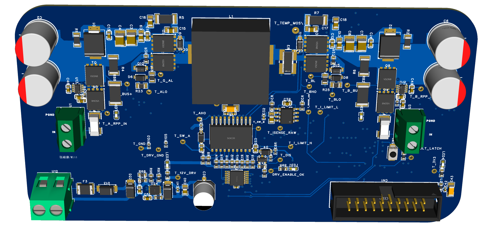
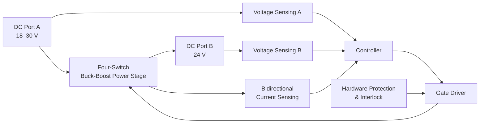
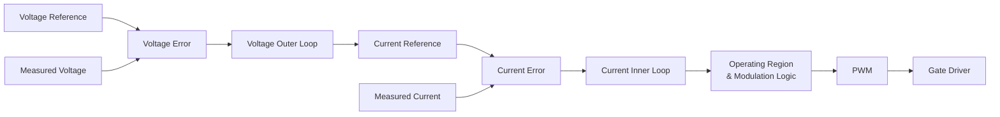
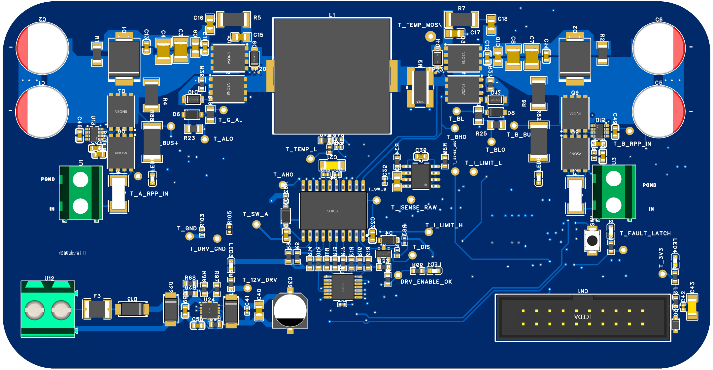
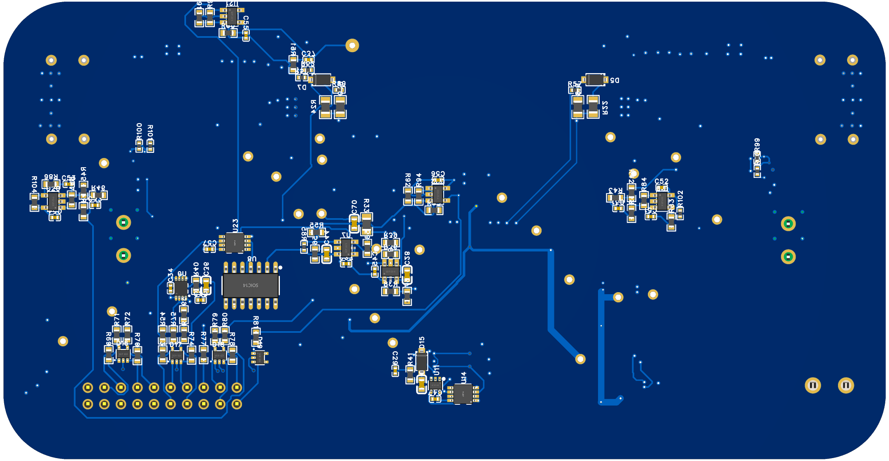

# 双向四开关 Buck-Boost 变换器

> **100 W · 100 kHz · 18–30 V ↔ 24 V · Bidirectional · CCM/DCM · Dual-Loop Control**

本项目用于记录一个**非隔离、同步、双向四开关 Buck-Boost DC-DC 变换器**的完整工程设计过程，包括系统需求、拓扑选择、功率级设计、器件选型、驱动与保护、控制策略、仿真验证、PCB 实现以及后续硬件测试。



---

## 1. 项目概述

### 这是一个什么项目？

这个项目最初并不是为了单独做一台 100 W DC-DC，而是来自我的另一个项目——**微电网系统**。

在微电网项目中，我设计了飞轮储能（FESS）和电池储能（BESS），并将储能系统连接到逆变器的公共 DC Bus。储能可以通过双向充放电参与功率平衡、削峰填谷以及电能质量调节。

在设计 BESS 接口时，一个问题变得无法绕开：

> **电池电压和 DC Bus 电压并不一定相等，但能量又必须能够双向流动。**

因此，双向 Buck-Boost 成为了储能设备与直流母线之间的重要接口，这也是本项目的起点。

### 为什么最后做成 100 W？

原微电网模型建立在 MATLAB/Simulink 中。

Simulink 有一个非常优秀的特点：

> **它基本不关心你的实验室预算。**

原模型中的逆变器直流母线达到约 **1200 V**，BESS 功率等级达到约 **50 kW**。在仿真里这没有问题，但把它直接做成个人硬件项目，无论从安全、成本还是实验条件来看都不现实。

所以我把其中最核心的功率变换问题抽象出来，缩小为一个低压实验平台：保留双向功率流、Buck/Boost、CCM/DCM、闭环控制、保护、器件选型和 PCB 实现等工程问题，同时把电压和功率降到适合个人实验验证的范围。

当前项目已完成拓扑、参数设计、主要器件选型、控制策略、保护电路、PSIM 仿真、原理图、6 层 PCB 与 DFM；下一阶段为硬件上电、闭环实机、效率与热测试。

> 本仓库的重点是展示**设计过程与工程取舍**，而不是提供一套可以直接复制生产的完整文件。

---

## 2. 设计需求

| 项目 | 目标 |
|---|---:|
| 拓扑 | 四开关同步非隔离 Buck-Boost |
| 功率流向 | 双向 |
| 功率等级 | **100 W** |
| A 端 | **18–30 V** |
| B 端 | **24 V 稳压端** |
| 开关频率 | **100 kHz** |
| 工作模式 | 额定负载 CCM / 轻载允许 DCM |
| 电感纹波率设计值 | **r = 0.4** |
| 效率目标 | **98.5%** |
| 输出纹波目标 | **< 0.1%** |
| 保护 | OCP / OVP / 电源异常关断 / 防直通 / 故障锁存等 |

> 98.5% 效率与 <0.1% 输出纹波是**设计目标**，最终是否达到以实物测试结果为准。精确保护阈值、控制器参数以及部分实现细节不在公开版本中提供。

---

## 3. 整体设计架构



### 设计流程


---

## 4. 功率级设计

### 4.1 拓扑选择

单独的 Buck 或 Boost 只能解决单一方向的升压或降压问题，而本项目要求：

- 支持 **A → B** 与 **B → A** 双向功率流；
- 在目标电压范围内同时具备 Buck 和 Boost 能力；
- 使用同步整流降低二极管导通损耗；
- 能够在 Buck、Buck-Boost 交接区和 Boost 之间切换；
- 为后续 CCM/DCM 和双闭环控制提供足够的控制自由度。

因此最终采用**四开关同步 Buck-Boost**拓扑。

---

### 4.2 主电感设计

主电感首先按照峰峰值电流纹波率

$$
r=\frac{\Delta I_L}{I_{L,\mathrm{avg}}}=0.4
$$

进行设计。

由于功率能够双向流动，不能只检查单一方向。对四个边界工况进行伏秒平衡校核：

| 工况 | 电感伏秒积 | 理论所需最小 `L` |
|---|---:|---:|
| 18 V → 24 V | 45 V·µs | 20.25 µH |
| 30 V → 24 V | 48 V·µs | 28.8 µH |
| 24 V → 18 V | 45 V·µs | 20.25 µH |
| 24 V → 30 V | 48 V·µs | 28.8 µH |

因此名义纹波目标下：

$$
\boxed{L_{\min}\approx28.8\ \mu H}
$$

考虑标准值以及制造公差、温升、直流偏置后的降感，最终选择：

$$
\boxed{L=33\ \mu H}
$$

#### 33 µH 下的纹波复核

对于 45 V·µs 工况：

$$
\Delta I_L=\frac{45}{33}\approx1.36\ \mathrm{A}
$$

对于 48 V·µs 工况：

$$
\Delta I_L=\frac{48}{33}\approx1.45\ \mathrm{A}
$$

实际器件筛选时不仅看“33 µH”这个标称值，还进一步关注：

- 约 6 A DC Bias 下的有效电感；
- 饱和电流裕量；
- RMS / 温升电流能力；
- DCR；
- 高频磁芯损耗；
- 屏蔽结构对板内 EMI 的影响。

工程筛选目标为：

| 指标 | 目标 |
|---|---:|
| 标称电感 | 33 µH |
| 高偏置下有效电感 | 优选接近或高于 28.8 µH；工程底线不低于约 26 µH |
| 饱和电流 | ≥10 A |
| 温升 / RMS 电流能力 | ≥8 A |
| DCR | <15 mΩ |
| 结构 | 屏蔽型 |

需要注意：如果高温或直流偏置使有效电感下降到约 26 µH，变换器仍可工作，但最坏工况下的纹波率会高于名义 `r = 0.4`，因此这属于降额状态，而不是继续声称满足原纹波目标。

铜损一级近似为：

$$
P_{Cu}=I_{L,\mathrm{RMS}}^2R_{DCR}
$$

> 我后来发现，电感数据手册里除了“33 µH”之外，居然还有很多东西要看。

---

### 4.3 输入 / 输出电容设计

以 **18 V → 24 V Boost** 工况进行一阶输出电容校核。

Boost 占空比：

$$
D=1-\frac{18}{24}=0.25
$$

100 W、24 V 输出时：

$$
I_o=\frac{100}{24}\approx4.17\ \mathrm{A}
$$

忽略 ESR / ESL 时，一阶关系为：

$$
C_{\min}=\frac{I_oD}{f_s\Delta V_o}
$$

若按 24 V 输出、0.1% 电压纹波目标：

$$
\Delta V_o=24\times0.1\%=0.024\ \mathrm{V}
$$

则：

$$
C_{\min}\approx\frac{4.17\times0.25}{100000\times0.024}\approx434\ \mu F
$$

因此每侧采用以 **2 × 220 µF / 50 V 铝电解**为主体，并配合多级陶瓷去耦的分布式电容网络。

实际选型还考虑：

- ESR / ESL；
- 纹波电流能力；
- 负载暂态；
- 热插拔与冷启动；
- 浪涌电流；
- MLCC 在 DC Bias 下的降容。

电容网络设计目标包括：

$$
ESR_{eq}<20\ \mathrm{m\Omega}
$$

以及总纹波电流能力大于约 3 A。

实际输出纹波还包含 ESR 等因素：

$$
\Delta V_{ESR}\approx\Delta I_C\cdot ESR
$$

所以仅仅满足 `C > Cmin` 并不能保证实物一定达到最终纹波目标。

> **计算器决定从哪里开始，示波器决定什么时候结束。**

---

### 4.4 MOSFET 选型

MOSFET 的选择目标不是单纯寻找最低 `RDS(on)`，而是在**导通损耗、开关损耗、驱动难度、反向恢复、耐压裕量与热性能**之间取得平衡。

#### 导通损耗

$$
P_{cond}=I_{RMS}^2R_{DS(on)}(T_J)
$$

`RDS(on)` 会随结温上升，因此不能只使用室温下的 headline value 做最终热设计。

#### 开关损耗

一级近似：

$$
P_{sw}\approx\frac{1}{2}V_{DS}I_D(t_r+t_f)f_s
$$

100 kHz 下，开关时间对损耗已经足够敏感。但开得越快也不是越好：过高的 `dv/dt` 和 `di/dt` 会增加 VDS 过冲、振铃、EMI、电流尖峰和寄生导通风险。

#### Gate Charge

驱动器需要不断给 MOSFET Gate 充放电：

$$
P_{gate}=Q_gV_{GS}f_s
$$

这部分主要属于**栅极驱动电源**的功耗预算。同时 `Qgd` 会明显影响 Miller 区间和 VDS 转换速度，因此也纳入比较。

#### Output Capacitance

`Coss` 为非线性参数，因此更倾向结合数据手册中的 `Eoss` 进行估算：

$$
P_{oss}\approx E_{oss}(V_{DS})f_s
$$

#### Reverse Recovery

同步变换器死区期间可能出现体二极管换流，因此 `Qrr` 也会影响：

- 开关损耗；
- 电流尖峰；
- 振铃；
- EMI；
- 器件瞬态应力。

#### 为什么选择 60 V 等级？

正常母线最高约 30 V，但真实开关节点还会受到寄生电感影响：

$$
V_L=L_{parasitic}\frac{di}{dt}
$$

因此实际 MOSFET 可能承受：

$$
V_{DS,actual}=V_{bus}+V_{overshoot}
$$

60 V 等级为开关过冲、振铃、负载暂态和连接寄生保留必要耐压裕量。这里的裕量针对的是**电压应力**，而不是简单地把“浪涌电流”与耐压混为一谈。

综合考虑：

- `VDS`
- `RDS(on)`
- `Qg`
- `Qgd`
- `Qrr`
- `Coss / Eoss`
- 脉冲电流能力
- SOA
- 封装与热性能

最终选择：

$$
\boxed{\text{CSD18540Q5B}}
$$

60 V N 沟道功率 MOSFET。

MOSFET 总损耗可概念性拆分为：

$$
P_{MOSFET}\approx P_{cond}+P_{sw}+P_{oss}+P_{rr}
$$

> 最低的 `RDS(on)` 并不会自动赢得比赛。很遗憾，电子似乎还认识 Qg。

---

### 4.5 RC Snubber 预留

为了处理实板上的 VDS 开关尖峰、寄生 LC 振铃以及高频 EMI，在功率开关附近预留了 **RC Snubber** 焊盘。

首板中该网络保持：

$$
\boxed{\text{DNP}}
$$

不在缺少实测寄生参数的情况下盲目确定阻容值。

上板后将根据：

- 振铃频率；
- VDS 过冲；
- 衰减速度；
- Gate Resistance；
- 不同负载下的开关波形；

重新确定最终的 `Rsnub` 与 `Csnub`。

Snubber 自身也会增加损耗，粗略与：

$$
P_{snub}\sim CV^2f_s
$$

相关，因此最终仍是**振铃抑制、EMI 与开关损耗**之间的折中。

> 寄生参数这种东西，通常在示波器上比在 Excel 里诚实。

---

## 5. 栅极驱动设计

四颗 N 沟道 MOSFET 构成两个半桥，因此栅极驱动需要满足：

- 高侧与低侧驱动；
- 约 10–12 V 的有效 `VGS`；
- 高占空比运行能力；
- 可控死区；
- 防止上下桥臂直通；
- 足够的 Gate Source / Sink 能力；
- 最重要的：**足够高的控制自由度**。

### 初始方案：MP6528

最初选择 MP6528，原因很直接：它能够集成驱动两个半桥、四颗 N 沟道 MOSFET，并提供较完整的高侧驱动与死区相关功能，从结构上看与四开关功率级非常匹配。

当时看起来：

> 四颗 MOSFET、一个驱动器、功能还挺全。事情好像突然变简单了。

事实证明，事情突然变简单的时候，一般应该提高警惕。

### 为什么后来更换？

问题并不是 MP6528 “驱不动 MOSFET”，而是**控制架构逐渐变得比标准 H 桥复杂得多**。

最终控制策略需要支持：

- Buck 区；
- Boost 区；
- Buck-Boost 交接区；
- 双占空比调制；
- 一侧高频、另一侧同步导通；
- 四颗 MOSFET 更独立的状态控制；
- 双向功率流；
- CCM / DCM 状态管理。

也就是说，在部分工作区域：

$$
D_A\neq D_B
$$

因此真正的问题不再是：

> “这个 IC 能不能驱动四颗 MOSFET？”

而变成：

> **“这个 IC 是否允许控制器决定这四颗 MOSFET 应该在什么时候开、什么时候关？”**

最终选择：

$$
\boxed{\text{HIP4081AIBZ}}
$$

核心原因是**控制自由度更高**，使驱动器服务于外部调制与状态机，而不是让控制策略迁就驱动器内部预设的桥式逻辑。

### Dead Time

死区过短可能导致上下管同时导通并形成直通；但死区过长又会增加体二极管续流时间、反向恢复和损耗。

因此目标不是“死区越大越安全”，而是：

$$
t_{dead}>t_{required}
$$

同时尽可能减少无意义的二极管导通时间。

> Dead time 太短，桥可能没了。Dead time 太长，效率会比较有礼貌地离开。

---

## 6. 电流与电压采样

### 6.1 电流采样

双向 Buck-Boost 的控制高度依赖电感电流，而毫伏级分流电压很容易受到大电流焊盘和 PCB 铜箔压降影响。

因此采用**四端 Kelvin 电流分流器**，将：

- Force 端：承载功率电流；
- Sense 端：仅用于精密采样；

物理上分开。

分流器到电流检测放大器之间采用 Kelvin 采样走线，以尽量避免功率路径电阻进入测量结果。

基本关系为：

$$
V_{shunt}=I_LR_{shunt}
$$

由于功率允许双向流动，电流检测链也必须能够识别正负电流。其概念关系可写为：

$$
V_{out}=V_{REF}+G\cdot V_{shunt}
$$

因此正向与反向电流会出现在 `VREF` 两侧。

电流放大器选型重点考虑：

- 双向电流检测；
- PWM 共模瞬态抑制；
- 带宽；
- 输入失调；
- 与 MCU ADC 范围的匹配。

具体最终料号以硬件 BOM / 最终原理图为准，公开 README 不提前写入存在版本冲突的料号。

> 四个焊盘并不是因为看起来比较高级，而是因为我不希望 PCB 铜皮也参与电流测量。

### 6.2 电压采样

A、B 两端均设置独立电压采样链，用于：

- 电压外环；
- 模式判断；
- 过压 / 欠压保护辅助判断；
- 状态监测。

采样链采用分压、RC 滤波以及 MCU ADC 接口。公开版本不提供完整分压阻值与精确阈值。

---

## 7. 保护架构

保护设计遵循一个基本原则：

> **严重故障不应完全依赖软件控制器“及时反应”。**

因此关键保护尽可能与正常控制环路分离，由硬件直接参与功率级关断与故障锁存。

当前设计包含的保护方向包括：

- 双向过流保护（OCP）；
- A / B 两端过压保护（OVP）；
- 电源异常 / 欠压关断；
- 栅极驱动互锁与防直通；
- 驱动电源保护；
- 故障锁存 / 硬件关断；
- 输入侧反接与异常接入保护。

保护链的设计重点是：**检测、比较、锁存、关断路径尽量清晰，并与正常闭环调节区分。**

精确动作阈值、分压参数以及部分逻辑实现不在公开版本中提供。

---

## 8. 控制策略

### 8.1 双闭环

整体控制架构为：



电压外环负责稳压并生成电流参考，电流内环负责快速调节功率级电感电流。

### 8.2 工作区域

控制策略覆盖：

- Buck 模式；
- Boost 模式；
- Buck-Boost 交接区域；
- A → B 与 B → A 双向功率流；
- 额定负载 CCM；
- 轻载 DCM。

在 Buck / Boost 交界附近采用专门的调制区域，使两个半桥能够以不同占空比参与调制，而不是强行在一个电压点进行硬切换。

轻载进入 DCM 后，需要结合电感电流过零行为与状态滞环，避免同步开关继续强迫负电流流动。

完整 PWM 真值表、模式切换阈值、占空比限制、PI 参数和 DCM/ZCD 精确判据不在公开版本中提供。

---

## 9. 仿真与验证

本项目使用 **PSIM** 对功率级和控制策略进行验证。

验证范围包括：

- 正向 Buck / Boost；
- 反向 Buck / Boost；
- CCM 稳态；
- 轻载 DCM；
- Buck / Boost 交接区；
- 输入电压变化；
- 负载变化；
- 模式切换；
- 保护相关工况。

### 9.1 稳态运行

重点检查：

- 输出电压；
- 电感电流；
- 电流纹波；
- PWM / Gate 时序；
- 稳态误差。

> 后续将补充经过筛选的公开版稳态波形图。

### 9.2 双向功率流

分别验证 A → B 与 B → A 工况，确认变换器能够在两种功率方向下进入正确工作区域并维持闭环稳定。

> 后续将补充正向 / 反向代表性波形。

### 9.3 暂态响应

暂态验证重点包括：

- 输入电压变化；
- 负载阶跃；
- 工作区域切换；
- CCM / DCM 转换；
- 电流峰值是否受控；
- 输出电压过冲与恢复时间。

### 9.4 保护验证

保护相关工况用于确认异常状态能够使功率级进入预期安全状态，而不是单纯依靠软件继续调节。

公开仓库只展示代表性结果，不公开完整保护参数表。

---

## 10. PCB 设计

最终 PCB 采用 **6 层设计**。

### PCB 顶面



### PCB 底面



### 3D 效果


### 布局重点

PCB 阶段重点考虑：

- 缩小高 `di/dt` 换流回路；
- 缩短 Gate Drive 回路；
- 高频去耦尽量贴近功率器件；
- Kelvin 电流采样；
- 功率路径与小信号路径分离；
- PGND / Signal GND 管理；
- 开关节点面积控制；
- 热扩散与散热过孔；
- 测试点与调试可达性；
- Snubber 实测整定位置。

这里讨论的是 **PCB Layout**，不与原理图的电气连接逻辑混淆。

### Snubber 预留

功率开关附近预留 RC Snubber 焊盘，首板保持 DNP。硬件上电后根据开关节点实际振铃确定是否焊接以及最终参数。

---

## 11. 硬件上电与调试计划

计划按照从低风险到高风险的顺序逐级验证：


计划重点测量：

- Gate 波形；
- VDS 开关节点与振铃；
- Dead Time；
- 电感电流；
- 输出电压纹波；
- 正反向效率；
- MOSFET 温度；
- 电感温度；
- 负载暂态；
- 模式切换行为。

硬件阶段还会据实测结果决定：

- Gate Resistance 是否调整；
- RC Snubber 是否需要焊接；
- 驱动速度是否需要折中；
- 控制器参数是否需要重新整定。

因为仿真模型里没有一种器件叫做：**“这块 PCB 上刚好存在的全部寄生参数”。**

---

## 12. 当前项目状态

| 项目 | 状态 |
|---|---|
| 系统架构设计 | ✅ |
| 功率级设计 | ✅ |
| 器件选型 | ✅ |
| 栅极驱动设计 | ✅ |
| 保护电路设计 | ✅ |
| 控制策略 | ✅ |
| PSIM 仿真 | ✅ |
| 原理图 | ✅ |
| 6 层 PCB | ✅ |
| DFM 检查 | ✅ |
| PCB / 装配准备 | 🔄 |
| 硬件上电调试 | ⏳ |
| 闭环硬件验证 | ⏳ |
| 效率测试 | ⏳ |
| 热性能测试 | ⏳ |
| Snubber 实测整定 | ⏳ |

---

## 13. 工程设计总结

### 1. 最低的 `RDS(on)` 并不意味着就是最合适的 MOSFET

MOSFET 选型必须同时考虑 `Qg`、`Qgd`、`Qrr`、`Eoss`、SOA、热性能与封装寄生参数。导通损耗和开关损耗本质上是一个综合权衡问题。

### 2. “集成度高”不一定等于“最适合”

MP6528 初看非常适合四开关功率级，但随着控制策略发展，我更需要四颗开关的控制自由度。最终改用 HIP4081AIBZ，本质上是从“尽量集成”转向“让硬件架构服从控制需求”。

### 3. PCB Layout 本身就是功率级设计的一部分

在 100 kHz 开关系统中，高频换流回路、Gate 回路、Kelvin 采样、去耦和接地都会直接进入实际电气性能。原理图正确并不代表实板自然正确。

### 4. 仿真不能替代硬件测试

寄生电感、开关振铃、Dead Time、温升、器件离散性和实际 EMI 都需要在真实 PCB 上确认。

### 5. 工程设计通常不是“算一次就结束”

电感要重新检查 DC Bias，电容要重新检查 DC Bias 和 ESR，MOSFET 要在热态重新检查 `RDS(on)`，Snubber 甚至应该等板子回来以后再决定最终值。

> **理论给边界，仿真给预期，实物给答案。**

---

## 14. 仓库公开范围

本仓库主要用于展示项目的：

- 系统架构；
- 工程设计方法；
- 关键设计决策；
- 公式与 worst-case 校核思路；
- 器件选型逻辑；
- 仿真结果；
- PCB 设计思路；
- 硬件验证流程。

以下内容不会在公开仓库中完整提供：

- 可直接生产的 PCB 源文件；
- Gerber / 制造文件；
- 完整生产级原理图；
- 完整 BOM；
- 完整固件源码；
- 精确控制器参数；
- 完整 PWM 真值表；
- 精确模式切换阈值；
- DCM / ZCD 详细判据；
- 部分保护阈值与关键实现参数。

本仓库的目的不是把一个 100 W Buck-Boost 搞得神秘，而是更希望展示：

> **我是怎么一步一步把它设计出来的。**

而不是：

> **这里有一套文件，下载以后点一下“生产”就可以了。**

---

## 计划中的仓库目录结构

```text
.
├── README.md
├── assets
│   ├── architecture
│   ├── schematic
│   ├── simulation
│   ├── pcb
│   └── measurement
└── docs
    └── 后续详细设计文档
```

目前仓库仍在整理中，后续会逐步把公开图片与详细设计笔记迁移到上述目录。

---

## License / 使用说明

本仓库用于学习、技术交流和个人工程作品展示。

目前不提供完整生产级设计文件，也未通过仓库内容授予第三方直接生产或商业复制本硬件的许可。后续如增加正式 License，将以仓库中的许可证文件为准。

---

## 最后

这个项目最开始只是微电网 BESS 接口中的一个方框。

后来这个方框变成了：

**公式、MOSFET、电感、电容、Gate Driver、电流采样、保护、控制、仿真、六层 PCB，以及大量：**

> “奇怪，为什么这里还有一个尖峰？”

下一步：

**让理论和实物见面。**

希望它们第一次见面的时候能相处得愉快。
