# 100 W 双向四开关 Buck Boost 变换器设计

  

  
  

## 项目状态

| **项目**         | **当前状态**     | **说明**                                             |
|------------------|------------------|------------------------------------------------------|
| PSIM 仿真        | 已完成阶段性验证 | 覆盖双向 Buck、Boost、交接区以及 CCM 与 DCM 典型工况 |
| 主功率板与插板   | 裸板已完成       | 尚未完成贴片、上电和满功率实验                       |
| 效率、纹波与保护 | 待实测           | 本文中的数值为设计目标或仿真结果，不代表实物测试结论 |

本报告记录首版硬件的设计依据、控制方法和阶段性验证结果。实板测试完成后，将继续补充效率、纹波、温升、动态响应和保护动作数据。

## 1 项目背景

本项目最初来源于我的另一个项目——微电网。

在微电网项目中，我设计了飞轮储能系统 FESS（Flywheel Energy Storage System）和电池储能系统 BESS（Battery Energy Storage System），两种储能系统均连接至逆变器的公共直流母线 DC Bus。

通过储能系统与电网之间的双向能量交换，可以实现充电与放电，并进一步参与削峰填谷、功率平衡以及电能质量调节。

在设计 BESS 的过程中，我需要一套支持双向功率流的 DC-DC 变换器，使储能单元能够与逆变器直流母线之间进行充电和放电。为了把系统级需求转化为可以实际制作和调试的硬件，我选择四开关双向 Buck-Boost 作为本项目的功率拓扑。

这成为了本项目的起点。

### 1.1 功率等级与实现范围

我的微电网设计与仿真主要在 MATLAB/Simulink 中进行。

在原微电网模型中，逆变器 DC Bus 电压达到约 1200 V，BESS 功率等级达到约 50 kW。

如果直接按照这一电压和功率等级设计实际双向 DC-DC 变换器，无论从安全、成本、器件选择还是个人实验条件来看，都不适合作为个人硬件项目实施。

因此，我从微电网系统中抽象出双向 Buck-Boost 拓扑不变，在其之上考虑硬件设计。

虽然主动降低了电压和功率等级，但依然保留了工程的复杂度。这个项目里，我保留了双向功率流，以及 Buck、Boost 两种基本工作模式，同时考虑额定负载下的 CCM 和轻载情况下的 DCM。

控制部分采用电压外环和电流内环，功率级从 MOSFET、电感、电容一直做到栅极驱动和双向电流检测。除了器件本身的选型，还要处理过流、过压等硬件保护问题，以及实际开关过程中不可避免的振铃和寄生参数影响。

在 PCB 阶段，我重点考虑大电流功率回路、栅极驱动回路和 Kelvin 采样回路之间的布局与回流路径。

因此，虽然整体功率只有 100 W 左右，但从拓扑、控制、器件选型、保护、PCB，到仿真和后续上板实验，完整的电力电子设计流程基本都保留了下来。

## 2 设计规格

本项目的基本设计规格如下：

| **参数**         | **设计值**                        |
|------------------|-----------------------------------|
| 拓扑             | 四开关同步非隔离双向 Buck-Boost   |
| 额定功率         | 100 W                             |
| A 端电压         | 18～30 V                          |
| B 端电压         | 24 V 标称控制点                   |
| 功率方向         | 双向                              |
| 开关频率         | 100 kHz                           |
| 设计电流纹波率   | $r = 0.4$                       |
| 额定负载状态     | CCM                               |
| 轻载状态         | DCM（控制策略仍在优化）           |
| 目标效率         | 98.5%（设计目标，待实测）         |
| 输出电压纹波目标 | ≤0.5%（首板目标；0.1%为挑战目标） |

B 端的 24 V 是当前控制与仿真的标称工作点，并不表示拓扑只能在该电压下运行。四开关双向 Buck-Boost 允许 A、B 两端在器件额定值、保护阈值和控制范围内作为输入或输出。本项目固定 B 端为 24 V，主要用于刻画 24 V 电池或低压直流母线一侧的工作状态。

## 3 功率级设计

### 3.1 主功率电感设计

主电感首先按照电流纹波率

$$
r = \frac{\Delta I_{L}}{I_{L,avg}} = 0.4
$$

由于我这是双向 Buck-Boost，A桥B桥都可以是输入/输出，所以需要校核在不同输入输出下的工况：主要是 18 V→24 V、30 V→24 V、24 V→18 V 和 24 V→30 V。

开关频率取 100 kHz，是在磁性器件体积、开关损耗、控制带宽和 EMI 之间的折中，对应开关周期为 10 µs。设计纹波率按平均电感电流的 40% 取值，再分别计算四个边界工况的电感伏秒积和所需电感量。

四个工况算下来的结果分别是：18 V→24 V 时，电感伏秒积约为 45 V·µs，对应理论电感约 20.25 µH；30 V→24 V 时约为 48 V·µs，对应 28.8 µH；反向的 24 V→18 V 和 24 V→30 V 分别也是 20.25 µH 和 28.8 µH。也就是说，在这几个边界点里面，30 V→24 V 和 24 V→30 V 对电感量的要求最高，所以理论下限大约在 28.8 µH。

以 18 V→24 V 为例，Boost 工况，理想占空比为

$$
D = 1 - \frac{18}{24} = 0.25
$$

一个周期内电感的伏秒积为

$$
18 \times 0.25 \times 10 = 45\text{~V} \cdot \mu s
$$

100 W 功率下，18 V 侧平均电流大约是

$$
I_{L} = \frac{100}{18} \approx 5.56\text{~}A
$$

如果按照 40% 的电流纹波来设计，那么

$$
\Delta I_{L} \approx 0.4 \times 5.56 = 2.22\text{~}A
$$

因此需要的电感量大约为

$$
L = \frac{45}{2.22} \approx 20.25\text{~}\mu H
$$

理论计算得到的最高下限为 28.8 µH。考虑制造公差、温升和直流偏置导致的有效电感下降，我没有贴着理论下限选型，而是采用 33 µH 成品电感，并继续通过饱和电流、温升电流、DCR 和磁芯损耗进行校核。

#### 3.1.1 33 µH 条件下的纹波校核

在 45 V·µs 工况下：

$$
\Delta I_{L} = \frac{45}{33} \approx 1.36\text{~A}
$$

在 48 V·µs 工况下：

$$
\Delta I_{L} = \frac{48}{33} \approx 1.45\text{~A}
$$

因此，33 µH 电感相对于理论最低值仍然具有一定设计裕量。

实际选型还需要同时检查 DCR、直流偏置下的有效电感、饱和电流、RMS 电流能力、磁芯损耗和 100 kHz 下的温升。因此，33 µH 不是单纯根据标称电感量确定，而是在电流能力、损耗、温升和器件体积之间取得平衡。

据此，我希望所选电感至少满足以下条件：

| **参数**         | **目标**                      |
|------------------|-------------------------------|
| 标称电感         | 33 µH                         |
| 大电流下有效电感 | 尽量保持在 28.8 µH 附近或以上 |
| 饱和电流         | ≥10 A                         |
| 温升额定电流     | ≥8 A                          |
| DCR              | \<15 mΩ                       |
| 结构             | 屏蔽型电感                    |

低 DCR 有利于降低电感铜损：

$$
P_{Cu} = I_{L,RMS}^{2}R_{DCR}
$$

同时采用屏蔽型电感，可以减小主功率电感磁场对板内电流检测和控制信号的 EMI 影响。

### 3.2 电容设计

输出电容的初步校核以 18 V → 24 V Boost 工况为边界。在当前四个标称边界工况中，该工况对 24 V 侧输出电容提出的容量要求最高。

Boost 模式占空比为：

$$
D = 1 - \frac{V_{in}}{V_{o}}
$$

代入：

$$
D = 1 - \frac{18}{24} = 0.25
$$

100 W 输出功率下：

$$
I_{o} = \frac{100}{24} \approx 4.17\text{~A}
$$

忽略 ESR 和 ESL 时，Boost 输出电容可以采用：

$$
C_{\min} = \frac{I_{o}D}{f_{s}\Delta V_{o}}
$$

进行初步计算。

先以 24 V 输出电压的 0.1% 作为挑战目标进行理想化计算：

$$
\Delta V_{o} = 24 \times 0.1\% = 0.024\text{~V}
$$

因此：

$$
C_{\min} = \frac{4.17 \times 0.25}{100000 \times 0.024} \approx 434\text{~}\mu F
$$

所以理论最低值约为：

$$
C_{\min} \approx 434\text{~}\mu F
$$

上述计算忽略了 ESR、ESL、制造公差、温度以及 MLCC 的直流偏压降容，只能作为名义容量下限。实际工作中还存在启动、负载阶跃和端口插拔等暂态，因此最终纹波必须结合器件阻抗曲线、PCB 寄生参数和实测波形判断。

两侧最后都用了 2 × 220 µF / 50 V 铝电解电容，再并联 10 µF / 50 V X7R、10 µF 陶瓷电容和 100 nF 高频陶瓷电容，大电容主要用来撑低频和瞬态，小电容则负责降低高频阻抗。

2 × 220 µF 的名义容量仅略高于 434 µF 的理想下限，不能据此证明 0.1% 纹波已经满足。首板将 ≤0.5% 作为验收目标，0.1%保留为后续优化方向。

同时电容组的纹波电流能力需要满足

$$
I_{ripple,rated} > 3\text{~A}
$$

另外还要把 ESR 带来的纹波算进去：

$$
\Delta V_{ESR} \approx \Delta I_{C} \cdot ESR
$$

### 3.3 MOSFET 选型与损耗

MOSFET 的总损耗可以粗略的表示为：

$$
P_{MOSFET} \approx P_{cond} + P_{sw} + P_{oss} + P_{rr}
$$

主功率 MOSFET 的选型不能只看耐压和$R_{DS(on)}$，还需要同时考虑导通损耗、开关损耗、栅极驱动损耗、输出电容损耗、反向恢复以及热性能及安全工作区（SOA）等因素。

#### 3.3.1 导通损耗

MOSFET 的导通损耗可近似表示为：

$$
P_{cond} = I_{RMS}^{2}R_{DS(on)}
$$

实际设计时还必须考虑温度升高后 $R_{DS(on)}$的增加。

#### 3.3.2 开关损耗

MOSFET 的开关损耗可以采用一级近似：

$$
P_{sw} \approx \frac{1}{2}V_{DS}I_{D}\left( t_{r} + t_{f} \right)f_{s}
$$

在 100 kHz 开关频率下，MOSFET 的开关时间、栅极电荷和结电容已经会明显影响损耗。

开关速度并不是越快越好。更快的边沿能够缩短开关过程并降低部分开关损耗，但也会放大 PCB 寄生电感和寄生电容的影响。过高的电压、电流变化率容易产生电压尖峰、电流尖峰和开关振铃，并增加 EMI 控制难度。

#### 3.3.3 栅极电荷

栅极驱动功率可以近似表示为：

$$
P_{gate} = Q_{g}V_{GS}f_{s}
$$

该部分主要计入栅极驱动器的功耗预算。

除了总栅极电荷 $Q_{g}$外，我还发现 $Q_{gd}$与 Miller 区间密切相关，会影响 MOSFET 的 VDS 转换速度和实际开关时间，进一步影响开关损耗和驱动器电流能力要求。

#### 3.3.4 输出电容损耗

MOSFET 的输出电容同样会参与每次开关过程。

$$
P_{oss} \approx \frac{1}{2}C_{oss}V_{DS}^{2}f_{s}
$$

不过实际的 $C_{oss}$并不是固定不变的，它会随着 $V_{DS}$明显变化，所以我会去找数据手册给出的 $E_{oss}$数据，再按照 $P_{oss} \approx E_{oss}f_{s}$去算，会更接近 MOSFET 实际的开关过程。

#### 3.3.5 反向恢复

同步 Buck-Boost 在死区期间，电感电流还需要有续流路径，这时候 MOSFET 的体二极管可能会短暂导通。等另一只 MOSFET 重新开通时，体二极管中已经存储的电荷需要先被抽走，因此反向恢复电荷 $Q_{rr}$也会直接参与开关过程。

如果 $Q_{rr}$比较大，换流瞬间就会出现更明显的反向恢复电流尖峰，不仅增加开关损耗，也会进一步激发功率回路里的寄生参数，带来更严重的振铃、MOSFET 瞬态应力和 EMI。

因此，最终 MOSFET 选型没有只看$R_{DS(on)}$，而是综合比较 $V_{DS}$、$R_{DS(on)}$、$Q_{g}$、$C_{iss}$、$C_{oss}$ 和 $Q_{rr}$，同时检查脉冲电流能力、SOA、热性能以及封装本身的寄生参数。很多参数之间本身就是互相牵制的，例如导通电阻做得很低以后，栅极电荷和结电容往往也会变大，所以最后还是要结合这块板子的电压、功率和 100 kHz 开关频率一起取舍。

### 3.4 MOSFET 耐压等级

主功率 MOSFET 没有按照 30 V 稳态上限贴边选型，而是采用 60 V 等级。相对于 18～30 V 的正常工作范围，它提供了稳态耐压余量；但早期 PSIM 模式切换中曾出现 40～50 V 甚至更高的暂态，因此不能仅凭额定耐压认定瞬态裕量已经充足。实板需要测量 VDS 过冲，并通过布局、栅极电阻和 RC Snubber 将峰值控制在可靠范围内。

我最终选择：

$$
\boxed{\text{CSD18540Q5B}}
$$

作为四颗主功率 N 沟道 MOSFET。

### 3.5 开关振铃与 RC Snubber

开关振铃这一块我没有准备在原理图阶段把参数直接定死，因为真正决定振铃的并不只是 MOSFET 本身，PCB 功率回路的寄生电感、器件封装、电容 ESL、栅极电阻以及实际工作电流都会参与进来。很多东西在板子真正做出来之前很难算准，所以我在四颗 MOSFET 附近都预留了 RC Snubber 的位置，电阻采用 2010 封装，电容采用 0802 封装，首板先全部 DNP。

等板子回来以后，再直接测 MOSFET 的 $V_{DS}$波形，看实际的过冲幅度、振铃频率和衰减速度，同时观察不同负载和 Buck、Boost 工况下有没有明显变化。根据这些实测结果再确定最终的 $R_{snub}$和$C_{snub}$。

RC Snubber 会引入额外损耗，其中电容每周期的充放电能量通常是主要来源，电阻则主要决定阻尼和峰值电流。参数不能简单理解为越大损耗越大，而应根据实测振铃频率和衰减情况共同整定。其损耗量级可用下式进行初步估算：

$$
P_{snub} \sim CV^{2}f_{s}
$$

## 4 栅极驱动与电流采样

MOSFET 定下来以后，接下来就是四颗 N 沟道 MOSFET 的驱动。这里我一开始的要求其实比较简单：栅极驱动电压希望在 10～12 V 左右，能够同时驱动两个半桥的四颗 MOSFET，高侧能够正常工作，并且要考虑较高占空比、死区以及足够的 Gate Source/Sink 电流能力。

### 4.1 最初选择 MP6528

最开始我选的是 MP6528。它本身就是面向两个半桥、四颗 N 沟道 MOSFET 的驱动方案，和四开关 Buck-Boost 的功率级结构刚好比较接近。

当时我比较看重它内部自带的约 11.5 V VREG。这样 Gate Drive 电源可以直接由芯片内部解决，不需要再单独做一套 12 V 驱动电源，而 10～12 V 左右的 $V_{GS}$对 CSD18540Q5B 也比较合适。高侧驱动还有辅助充电机制，对高占空比工作会更友好，死区也可以通过外围器件调整。

### 4.2 改用 HIP4081AIBZ

后来我发现问题不只是“能不能驱动四颗 MOSFET”。

四开关 Buck-Boost 在不同电压关系下并不是始终按照固定的 H 桥方式工作。我这里需要在 Buck、Boost 和 Buck-Boost 交接区域之间切换，还要考虑双向功率流、CCM/DCM，以及两个桥臂占空比之间的关系。有些工况是一侧进行高频 PWM，另一侧保持同步导通；到了交接区域，两侧又可能同时参与调制。

这时候 Q1、Q2、Q3、Q4 的状态已经不适合完全交给一个内部逻辑比较强的驱动器去决定。我希望控制器能够更自由地决定四颗 MOSFET 怎么开、什么时候开，而驱动芯片主要负责把逻辑信号变成足够强的栅极驱动。

MP6528 本身集成了比较多 H 桥控制和保护逻辑。对于常规 H 桥来说这些功能很方便，但到了我的四开关 Buck-Boost 控制里，影响了我的控制自由度。

所以后来把驱动器换成了 **HIP4081AIBZ**。它仍然可以完成两个半桥四颗 N-MOSFET 的高低侧驱动，但四路输入控制更直接，这样 Buck、Boost、交接区以及双向运行时的具体开关状态可以更多地留给外部控制器处理。

### 4.3 Dead Time 设计

同一桥臂的上下两颗 MOSFET 必须留出死区，避免上一颗器件尚未关断时另一颗已经开通而造成桥臂直通。HIP4081AIBZ 可通过 HDEL、LDEL 外接电阻设置开通延时；本设计由硬件提供基础延时，主要的 200 ns Dead Time 由 STM32 生成。该数值目前属于设计设定，最终有效死区需要在实板上分别测量上下管 VGS 后确认。

### 4.4 电流分流器与 Kelvin 采样

因为后面要做电流闭环，所以这里电感电流采样的精度十分重要。这里如果直接用普通两端分流电阻，大电流经过焊盘和 PCB 铜皮时产生的压降也有可能一起被采进去，最后测到的就不完全是分流器本身的压降。

所以我这里选了四焊盘结构的电流分流器，直接做 Kelvin 采样。功率电流从 Force 端走，Sense 端单独从分流器本体两端把电压引出来，尽量不让大电流铜皮和焊盘接触电阻混进采样结果里面。

理想情况下，采样关系就是欧姆定律： $V_{shunt} = I_{L}R_{shunt}$。

这样可以提高采样信号的完整性和精度，也让 PCB 回路关系更明确：主电流沿功率路径流动，Kelvin Sense 两根线从独立采样点引到电流采样放大器，不与功率铜皮共用取样位置。

### 4.5 双向电流检测

由于变换器支持双向功率流，所以电流采样除了要测大小，还要能判断方向。这里我选用了 **INA240A1DR**，通过参考电压把零电流点抬到中间位置，MCU 根据输出电压高于还是低于参考值判断电流方向。

这一路信号主要用于电流内环、DCM 检测和过流保护。

## 5 硬件保护

这块板子的保护我没有全部交给 MCU。像过流、过压这一类故障，我希望在软件还没有来得及处理之前，硬件就能先把功率级关掉，所以另外做了一套独立的硬件保护路径。

### 5.1 防反接

A、B 两端都有可能连接外部电源或者电池，所以我在两个端口都做了防反接。这里使用 **LM74502 配合外部 N 沟道 MOSFET** 来完成。

选择 LM74502 还有一个比较重要的原因：它负责的是输入极性反接保护，本身并不会把正常工作时的反向电流堵住，所以不会和双向 Buck-Boost 本身的双向功率流冲突。

也就是说，正常接线时这一部分尽量保持低损耗导通；真正把端口极性接反时，再由它把错误电压隔离在功率级之外。

### 5.2 双向过流保护

因为功率可以双向流动，所以过流保护也不能只检测一个方向。前面的 INA240 输出以参考电压作为零电流点，正向和反向电流分别对应参考电压两侧，因此我另外设置了正、反两个硬件过流阈值。

当前设计的保护点大约在 **±8.4 A**。正常的电流闭环仍然由 MCU 处理，但一旦电流真正越过硬件保护范围，就不再等软件判断，而是直接进入故障逻辑并封锁栅极驱动。

这样电流环负责“控制电流”，硬件比较器负责“保护”，两套东西的职责是分开的。

### 5.3 过压保护

A、B 两端也分别做了电压监测和硬件过压保护。正常工作最高电压大约在 30 V 左右，所以保护阈值会放在正常工作区间之外，既不能因为普通的纹波和短时间开关尖峰频繁误触发，也不能高到失去保护意义。

过压判断没有只依赖 MCU ADC，而是保留独立比较器通道。只要检测信号满足比较器的动作条件，故障信号就直接进入锁存与门控逻辑，关闭功率级；实际抗尖峰能力由分压、滤波、迟滞和比较器传播延时共同决定。

### 5.4 故障关断与锁存

过流和过压信号并不是直接送给 MCU 以后就结束了。我这里另外做了一层硬件故障锁存，主要考虑的是如果故障只出现很短的一瞬间，MCU 可能还没来得及采到，或者软件还没进入处理流程，故障信号就已经消失了。

正向和反向过流先合成为 FAULT_OC，A、B 两侧过压合成为 FAULT_OV，最后再汇总成 FAULT_SET。锁存部分使用 **74LVC2G02 双 NOR 门**组成 SR Latch。一旦 FAULT_SET 被触发，NOT_FAULT 会立即拉低，并且即使原来的过流或过压已经消失，故障状态也不会自己恢复。

这个 NOT_FAULT 后面继续参与驱动使能和 PWM 硬件门控，所以出现故障以后，不需要等 MCU 执行关断程序，硬件逻辑就可以先把送往栅极驱动器的 PWM 切掉。

故障解除以后也不会自动重新启动，而是需要重新给出 FAULT_RESET。我还保留了手动复位按键，方便上板调试的时候直接解除锁存。这样做主要是为了避免短路、过流这类故障还没有真正排除，功率级就反复启动、关断。

这条保护链路分为三层：比较器发现故障，锁存逻辑保持故障状态，PWM 门控切断栅极驱动。MCU 负责读取状态并决定何时允许复位，从而降低系统对软件响应时间和软件正常运行状态的依赖。

### 5.5 ESD 与接口瞬态保护

A、B 两个端口都会直接连接外部电源、电池或者实验设备，所以除了前面的过压和防反接，我还考虑了接口上的 ESD 和瞬态干扰。

这类尖峰持续时间可能很短，靠 MCU 或普通电压检测来处理已经太慢，所以保护器件需要尽量靠近外部接口放置，把瞬态电流在进入功率级之前就泄放掉，同时尽量缩短保护器件到接口和地之间的回路。

控制板和功率板之间有不少低压信号，包括四路 PWM、故障与复位、电流和电压采样，以及温度信号。这些线最后都要进 MCU 或逻辑器件，所以我在接口位置增加了 ESD 保护，避免插拔、调试或者外部静电直接打到 3.3 V 逻辑侧。

主要使用 **PESD3V3L4UG** 对多路信号进行钳位，包括 PWM、FAULT、FAULT_RESET、电流电压采样以及温度检测信号。大部分接口前后还串了约 **100 Ω** 的电阻，一方面限制瞬态电流，另一方面也可以稍微缓和高速边沿和接口噪声。3.3 V 外部电源这边也单独留了 ESD 保护。

这一级主要处理的是控制接口上的快速静电和瞬态干扰，和前面的过压、过流、防反接不是一回事。前者保护 MCU 和逻辑信号，后者才是针对主功率回路的异常状态。

### 5.6 电感温度检测

主功率电感除了看额定电流和饱和电流，我还单独留了温度检测。因为电感的损耗不仅有 DCR 带来的铜耗，在 100 kHz 下还存在磁芯损耗，而且这些损耗都会随着实际电流、纹波和工作模式变化。

所以单纯根据数据手册估算温升还不够，我希望上板以后能直接看到电感真实的工作温度。温度信号送给 MCU 做监测，在长时间高功率运行或者散热条件比较差时，可以用来判断电感是不是已经进入不合适的工作区间。

### 5.7 12 V 栅极驱动电源保护

栅极驱动使用独立的 12 V 电源，这一路虽然功率不大，但一旦电压异常，最后影响的是四颗主功率 MOSFET 的开关状态，所以我没有直接把外部 12 V 接到驱动器上。

12 V 输入端先经过保险丝、肖特基二极管和 TVS：保险丝承担短路或持续过流后的隔离，肖特基二极管用于反接保护，TVS 用于钳位插拔产生的瞬态电压。后级 TPS26620 eFuse 再执行欠压、过压和过流限制，电源状态满足要求后才向栅极驱动部分供电。

## 6 测量接口与接地

### 6.1 电压测量

除了前面的电感电流，A、B 两端电压也需要送给 MCU。这里主要是为了给电压外环、Buck/Boost 工作区判断以及运行状态监测提供输入。

A、B 两侧都采用电阻分压后再送入 ADC，目前使用的是 **82 kΩ / 6.8 kΩ** 的分压结构，比例大约为

$$
\frac{6.8}{82 + 6.8} \approx 0.0766
$$

所以即使端口电压在 30 V 左右，送到 MCU ADC 的电压也只有大约 2.3 V，还留有一定余量。

采样端另外做了简单的 RC 滤波，用来压掉一部分开关噪声。

### 6.2 外部控制接口

功率板和 MCU 控制板之间通过独立接口连接，四路 PWM、故障状态、复位、电流电压采样以及 MOSFET、电感温度信号都从这里进出。

3.3 V 逻辑电源在接口处经过磁珠，并配置本地去耦；控制信号 ESD 保护也集中在接口侧。这样可以把功率板和控制板的供电与信号边界划分清楚，便于后续分板检查。

### 6.3 接地分区与回流路径

这块板子没有把所有回流路径无条件混在同一片铜上，而是按照功能区分为 PGND、DRV_GND 和 GND。PGND 承担主功率回路的大电流回流，DRV_GND 服务于 12 V 栅极驱动，其余采样、逻辑和控制信号以 GND 为参考。

PCB 上，主功率器件主要放在顶层，PGND 则放在功率区域正下方，尽量让开关电流的去路和回路贴得更近，减小高 $di/dt$回路面积和寄生电感。PGND 大约覆盖板子的上半部分，但我没有为了刻意铺满而让它进入控制和采样区域，PWM 使能逻辑以及 Kelvin Sense 附近都尽量避开，避免功率回流从这些敏感信号下面经过。

第四层 GND 基本覆盖整块 PCB，为控制、采样和其他小信号提供参考；DRV_GND 主要分布在顶层和部分底层，并通过较宽铜连接到 GND。由于第四层在部分功率区域下方仍然存在，首板需要重点观察开关节点对参考平面的电容耦合和共模噪声。

三个地最终并非完全隔离，而是在 PCB 左下方的指定位置汇合。这样做的目的，是让功率回流、驱动回流和小信号回流优先在各自区域内闭合，减少主功率电流穿越采样与控制区域。该汇合位置属于首板布局选择，后续将结合地弹、驱动回流和电流采样噪声的实测结果评估是否需要调整。

### 6.4 状态指示灯

为了调试方便，我在板上保留了几组最基本的状态指示灯，包括 A、B 两侧母线电压、3.3 V 逻辑电源、12 V 栅极驱动电源、驱动使能状态以及故障锁存状态。

A、B 母线的指示灯分别通过 22 kΩ 电阻直接接在母线上，主要用来确认两侧有没有上电；3.3 V 和 12 V 电源也各自有独立指示。这样可以直接把驱动允许和故障状态显示出来，上板以后不用每次都先拿万用表或者示波器确认这些基本状态。

这些 LED 都只作为状态显示使用，所以电流没有设得很大，尽量减少不必要的功耗。尤其是后面调试启动、保护和故障复位的时候，直接看板上的灯就能先判断系统大概停在哪一层。

## 7 PCB 布局

主功率板采用六层结构，功率器件主要位于顶层，内部层分别承担功率回流、信号与逻辑电源分配，底层布置采样和保护电路。

| **层** | **主要功能**                                                                 |
|--------|------------------------------------------------------------------------------|
| 顶层   | 主电感、MOSFET、功率回路、防反接、栅极驱动、控制接口、电流采样核心与状态指示 |
| 第二层 | PGND，主要覆盖功率区域，并避开 PWM 使能和 Kelvin 采样区域                    |
| 第三层 | Kelvin、PWM、ADC 等信号走线                                                  |
| 第四层 | GND 参考平面，基本覆盖整板                                                   |
| 第五层 | 3.3 V 逻辑电源分配                                                           |
| 底层   | ADC、故障锁存、温度检测以及过流过压关断电路                                  |

### 7.1 功率区与控制区

整块 PCB 在布局上大致可以分成上下两部分。上半部分主要是功率级，MOSFET、电感、功率电容、防反接以及驱动电路都集中在这里；下半部分主要是 ADC、保护逻辑、接口和其他小信号电路。

这种划分主要还是不希望高 $di/dt$、高 $dv/dt$的开关区域和微弱的采样信号混在一起。

顶层主功率网络采用铜皮连接，并尽量缩短高频电流回路。SW_A 和 SW_B 需要兼顾载流与寄生电容：在满足电流密度和温升要求的前提下控制铜皮面积，减少对参考平面的电容耦合和共模 EMI，而不是单纯追求更大的铺铜范围。

### 7.2 栅极驱动布局

HIP4081AIBZ 和对应的 Gate 走线尽量靠近 MOSFET。Gate 本身虽然不属于主功率电流，但开关瞬间同样存在比较大的脉冲电流，所以 Gate 和 Source 的驱动回路面积也需要尽量小。

栅极电阻放在靠近 MOSFET 的位置，后面如果上板发现开关边沿太快、振铃明显，可以直接通过调整 Gate 电阻改变开关速度，不需要重新改整块 PCB。

RC Snubber 也是同样的思路，器件位置已经提前留在 MOSFET 附近，首板先 DNP，等实际测到 $V_{DS}$振铃以后再决定参数。

### 7.3 Kelvin 与 ADC 采样

电流采样这一块我单独处理。四端分流器的大电流焊盘直接进入功率路径，而 Sense 焊盘单独引线，Kelvin 两根线尽量成对走，不和功率铜皮共享路径。

栅极驱动与对应的 Source 回流按同一局部回路处理。Gate 走线从驱动器经栅极电阻到 MOSFET，Source 回流连接到相应器件的源极参考；需要换层时使用相邻过孔，避免驱动电流绕行控制地。

四端分流器的两根 Sense 线从独立采样焊盘引出，换层后在第三层成对走向电流采样放大器，并避开 Switch Node 和栅极驱动线。采样连接不与主功率铜皮共用取样点。

顶层双向电流采样核心与底层 ADC、过流过压关断电路采用上下对应的紧凑布置，通过就近过孔连接，减少模拟信号在板内的绕行距离。

电压采样和温度采样同样集中放在控制区域，和功率级之间只保留必要的检测连接。

### 7.4 主功率级布局

主功率级基本沿着 A 端—A 桥—主电感—B 桥—B 端的能量路径展开。四颗主 MOSFET 分别靠近两侧桥臂放置，尽量缩短开关节点到电感、母线电容之间的连接，减少高 $di/dt$回路面积和寄生电感。

A、B 两端的防反接 MOSFET 和输入输出电容都靠近接口放置，外部电流进入 PCB 后先经过保护，再进入主功率回路。这样可以避免大电流在板上绕行，同时让母线电容尽量靠近桥臂，为 MOSFET 开关瞬间提供就近的脉冲电流。

主功率连接采用铜皮而不是细走线。A_BUS、B_BUS 和 PGND 重点保证载流能力，并利用第二层 PGND 缩短相应回流路径；SW_A、SW_B 则在满足载流与温升要求的前提下限制面积，避免寄生电容和 EMI 不必要地增加。

33 µH 主电感放在两个桥臂之间，功率路径基本保持直线。电感旁边的电流分流器同样靠近主电流路径放置，但 Kelvin Sense 单独从采样端引出，不和功率铜皮共用连接。这样主功率电流可以直接通过铜皮和器件流动，而采样信号则从另一条路径进入后面的检测电路。

首板在 SW_A、SW_B 及其相邻高 dv/dt 区域下方设置了第二层 PGND 禁布区，以减小开关节点与 PGND 之间的寄生电容。第四层 GND 仍基本保持连续，因此这一处理属于首板折中，后续将根据共模噪声和开关波形决定是否扩大跨层禁布范围。

板上预留了直径 1 mm 的测试焊盘。首板到板后发现该尺寸不便于示波器探头稳定夹取，问题已经记录，后续版本将增大测试点并补充接地弹簧连接位置。

## 8 控制策略

### 8.1 电压外环与电流内环

控制器采用电压外环和电流内环的双闭环结构。当前仿真中两环均以 10 µs 周期更新，对应 100 kHz 控制更新频率；电流环目标带宽约 5 kHz，电压环目标带宽约 500 Hz，两者相差约一个数量级。电压参考同时加入软启动，减小启动或模式切换时参考值与实际值差距过大造成的暂态电流。

### 8.2 Buck Boost 工作区

当功率从 A 端流向 B 端，并且 $V_{A} > V_{B}$时，需要降压，工作在 **Buck 区**。A 侧桥臂进行 PWM 调制，控制电感每个周期吸收多少能量；B 侧桥臂主要保持同步导通，把电感电流送到 B 端。理想情况下，占空比大致满足

$$
D_{\text{Buck}} \approx \frac{V_{B}}{V_{A}}
$$

当 $V_{A} < V_{B}$时，需要把 A 端电压升高后再送到 B 端，进入 **Boost 区**。这时 A 侧主要保持导通，B 侧桥臂进行 PWM 调制，通过电感的储能和放能实现升压。理想 Boost 关系为

$$
D_{\text{Boost}} \approx 1 - \frac{V_{A}}{V_{B}}
$$

功率反向后，输入端和输出端的角色发生交换，但高频调制的物理桥臂仍按两端电压关系选择。在本设计的单桥臂调制区，A 端电压高于 B 端时，正向降压和反向升压均由 A 桥高频调制、B 侧高管保持导通；A 端电压低于 B 端时，正向升压和反向降压均由 B 桥高频调制、A 侧高管保持导通。控制器同时调整电流参考方向，以及相应的 PWM 和同步整流时序。

这里不能简单固定成一种模式。如果一直使用 Buck，当输入电压低于输出电压以后就失去了升压能力；一直使用 Boost，在输入电压高于输出电压时同样不合适。理论上也可以让四颗 MOSFET 在所有工况下都参与高频调制，但这样会增加开关损耗、栅极驱动损耗和 EMI，对效率没有好处。

所以我的处理方式是：电压差比较明显时分别使用 Buck 或 Boost，让一侧桥臂高频工作，另一侧尽量保持导通；当 $V_{A}$和 $V_{B}$比较接近时，再进入四开关的 Buck-Boost 交接区，由两侧共同调制。这样既能覆盖完整的升降压范围，也能减少没有必要的高频开关。

### 8.3 Buck Boost 交接区与双占空比调制

前面的 Buck 和 Boost 都比较直接：电压差比较大时，只需要一侧桥臂做高频 PWM，另一侧保持直通。但当 $V_{A}$和 $V_{B}$很接近时，如果直接从 Buck 硬切到 Boost，四颗 MOSFET 的工作状态会突然改变，占空比也会出现跳变，所以我没有在 $V_{A} = V_{B}$附近直接切模式，而是单独设置了一个 Buck-Boost 交接区。

交接区采用双占空比控制（采用占空比固定差值法，美国专利 US 7,804,283 B2），定义 $D_{\text{buck}}$和 $D_{\text{boost}}$。以 A→B 为例，一个开关周期内实际上只有三个主要状态：

| **状态** | **导通组合** | **电感电压**      | **持续时间**                                               |
|----------|--------------|-------------------|------------------------------------------------------------|
| 储能     | Q1 + Q4      | $V_{A}$         | $D_{\text{boost}}T_{s}$                                  |
| 传能     | Q1 + Q3      | $V_{A} - V_{B}$ | $\left( D_{\text{buck}} - D_{\text{boost}} \right)T_{s}$ |
| 续流     | Q2 + Q3      | $- V_{B}$       | $\left( 1 - D_{\text{buck}} \right)T_{s}$                |

三个状态的时间加起来刚好是一个开关周期。按照电感伏秒平衡，可以得到

$$
\frac{V_{B}}{V_{A}} = \frac{D_{\text{buck}}}{1 - D_{\text{boost}}}
$$

交接区让两个占空比保持固定差值：

$$
D_{\text{buck}} - D_{\text{boost}} = K
$$

最后取

$$
K = 0.70
$$

限制

$$
D_{\min} = 0.10,\ D_{\max} = 0.90
$$

100 kHz 下一个周期是 10 µs，因此 10% 占空比对应 1 µs，也给 200 ns Dead Time 留出了足够的有效脉宽。

当两端电压接近相等时，

$$
V_{A} \approx V_{B}
$$

对应的中心工作点为

$$
D_{\text{buck}} = 0.85,\ D_{\text{boost}} = 0.15
$$

刚好满足

$$
0.85 - 0.15 = 0.70
$$

这组固定差值关系用于协调交接区内两个桥臂的占空比。进入或退出交接区时，仍需处理占空比映射、控制器状态和 PWM 时序的衔接；仅靠固定差值和模式滞环，不能保证切换时没有占空比跳变或电流暂态。当前切换效果见第 9 节的仿真波形。

### 8.4 Buck 交接区 Boost 模式切换

模式判断使用滤波后的两端电压：

$$
\varepsilon = \frac{V_{A} - V_{B}}{\max\left( V_{A},V_{B} \right)}
$$

当 $V_{A}$明显高于 $V_{B}$时，由 A 桥高频调制、B 桥直通；

当两端电压接近时进入四开关交接区；

当 $V_{A}$明显低于 $V_{B}$时，则换成 B 桥高频调制、A 桥直通。

我没有把进入和退出阈值设成完全相同，留了 1% 的滞环：

| **当前状态**     | **切换条件**                | **下一状态**     |
|------------------|-----------------------------|------------------|
| A桥高频，B桥直通 | $\varepsilon \leq + 10\%$ | 交接区           |
| 交接区           | $\varepsilon \geq + 11\%$ | A桥高频，B桥直通 |
| B桥高频，A桥直通 | $\varepsilon \geq - 10\%$ | 交接区           |
| 交接区           | $\varepsilon \leq - 11\%$ | B桥高频，A桥直通 |

这 1% 的差值主要是为了防止 $V_{A}$和 $V_{B}$在边界附近有纹波或者采样噪声时，状态机在 Buck 和交接区、或者 Boost 和交接区之间反复跳变。

### 8.5 PWM 与 Dead Time

STM32 根据工作区和功率方向生成四路 PWM。每个桥臂的上下管保持互补关系，并插入 200 ns Dead Time；NOT_FAULT 和驱动使能同时参与硬件门控，任一故障均可使栅极驱动输入进入关断状态。

200 ns 是控制器中的设计值，最终需要以 MOSFET 引脚处测得的 VGS 为准，分别确认上一颗器件关断到下一颗器件开通之间的有效死区。

下表给出 A→B 方向的基本调制关系。B→A 时，应按实际输入、输出电压重新判断升压或降压；高频调制的物理桥臂仍遵循第 8.4 节的电压分区规则，不能直接将 A、B 桥互换。表中的保持导通状态适用于正常能量传输，轻载零电流区间另按 DCM 策略处理。

| **工作区** | **高频调制桥臂** | **保持导通器件** | **说明**             |
|------------|------------------|------------------|----------------------|
| Buck       | A 桥 Q1 Q2       | B 侧高管 Q3      | A 端高于 B 端        |
| 交接区     | A 桥与 B 桥      | 无固定单侧直通   | 两侧采用协调双占空比 |
| Boost      | B 桥 Q3 Q4       | A 侧高管 Q1      | A 端低于 B 端        |

### 8.6 CCM 与 DCM

额定负载以 CCM 为主，轻载允许进入 DCM。控制器根据滤波后的电感电流和零电流检测条件判断导通状态，并在接近零电流时调整同步整流策略，避免无意的反向电流。

当前 DCM 进入和退出阈值分别按约 1.5 A 和 2.0 A 设计，并要求条件持续三个开关周期；零电流检测阈值暂取 0.08 A。

轻载仿真已经出现断续电流区间，但过零后的微小反向振荡仍需继续优化，因此本报告把 DCM 视为阶段性结果，而不是已完成的硬件验证。

## 9 PSIM 仿真验证

### 9.1 仿真模型

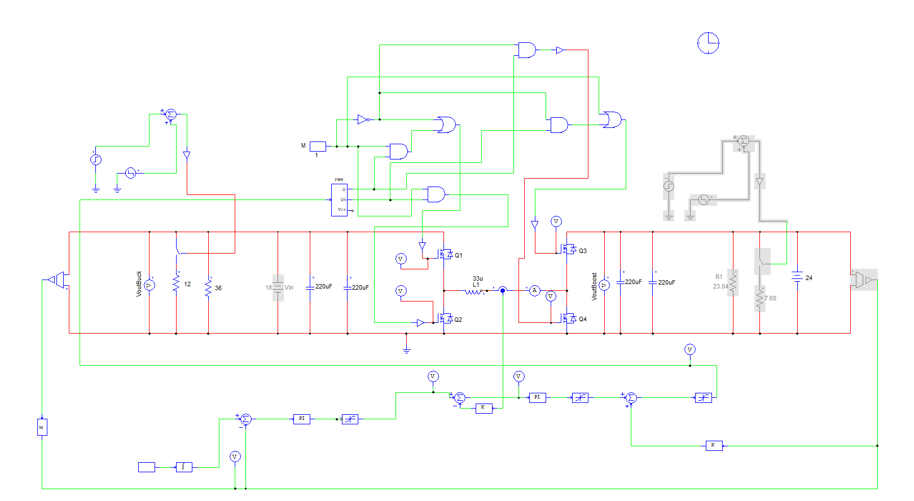

图 1 四开关双向 Buck-Boost 的 PSIM 仿真模型

第一阶段先使用理想 MOSFET 和电感模型，验证双向功率流、稳态参数和功率级拓扑是否正确。

第二阶段加入 MOSFET 二级模型、电感一级模型、12 V 栅极驱动、完整 PWM、交接区控制以及原理图中的主要电容参数。该模型用于提前发现控制和器件应力问题，但仍不能替代 PCB 寄生参数提取和实物测试。

### 9.2 正向功率流模式跨越

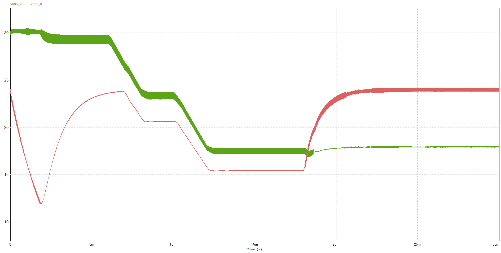

图 2 A 端 30 V 24 V 18 V 变化时的两端母线电压响应

该图包含启动和工作点切换过程。B 端在前段出现约 11 V 的最低点，因此它用于展示控制器跨越 Buck、交接区与 Boost 的工作过程，不作为最终稳压性能通过依据。后续将分别给出启动、输入阶跃和稳态窗口。

### 9.3 电感电流动态响应

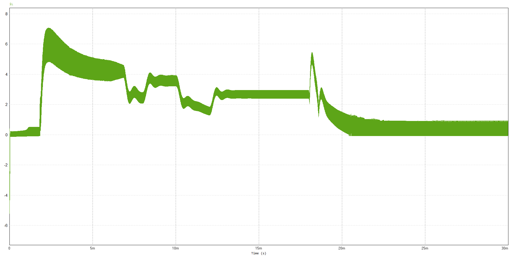

图 3 正向综合工况下的电感电流动态响应

电感电流随输入电压、负载和工作区发生变化。切换时存在明显暂态峰值，当前结果主要证明状态机和功率流方向能够连续运行；峰值电流和恢复时间仍需在分工况波形中单独量化。

### 9.4 重载 CCM 电感电流

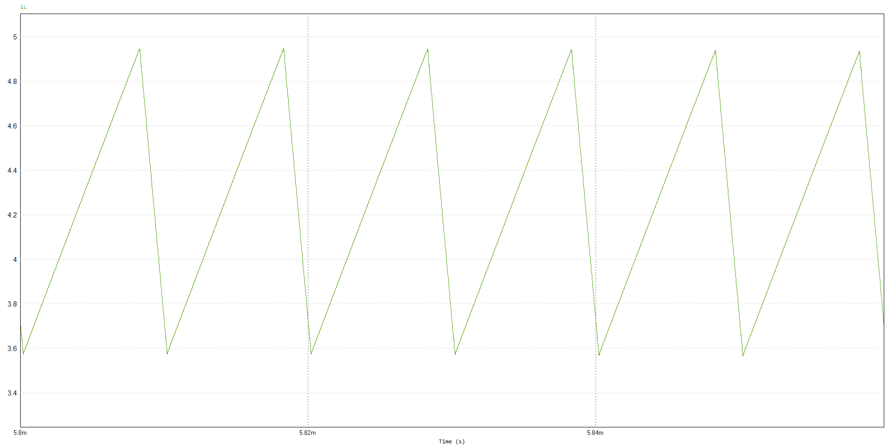

图 4 重载 CCM 稳态电感电流

所选稳态窗口内电感电流保持连续，峰峰值约为 1.4 A，与 33 µH 电感的理论纹波校核基本一致。

### 9.5 轻载 DCM 电感电流

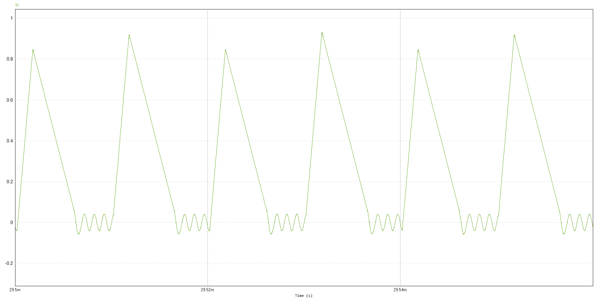

图 5 轻载 DCM 电感电流

电流已经出现零电流区间，但过零后仍有小幅负向振荡。因此该波形只作为 DCM 阶段性结果，ZCD 阈值、模式退出条件和同步管关断时序仍需继续优化。

### 9.6 反向 24 V 至 30 V Boost

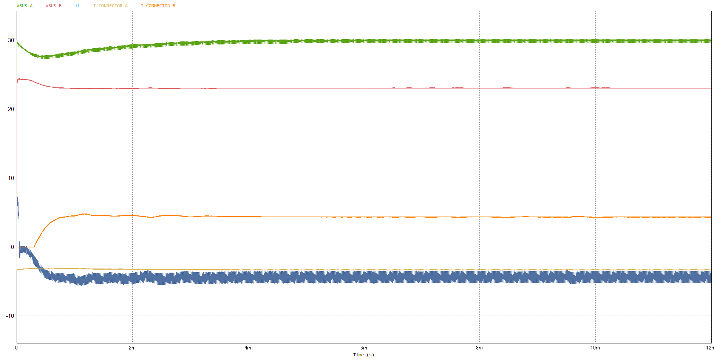

图 6 B 端向 A 端传输时的 24 V 至 30 V Boost 响应

本工况由 B 端向 A 端供能，B 端标称电压为 24 V，A 端目标电压为 30 V。图中 VBUS_A（绿色）和 VBUS_B（红色）分别为两端母线电压，单位为 V；iL（蓝色）为电感电流，I_CONNECTOR_A（浅橙色）和 I_CONNECTOR_B（橙色）为两端接口电流，单位为 A，横轴为时间。电感电流以 A→B 为正，因此反向传能时 iL 为负。波形展示 A 端电压经历暂态后恢复至约 30 V 的过程；B 端实际母线电压以红色曲线为准，标称 24 V 不代表全过程恒定为 24 V。

### 9.7 反向 24 V 至 18 V Buck

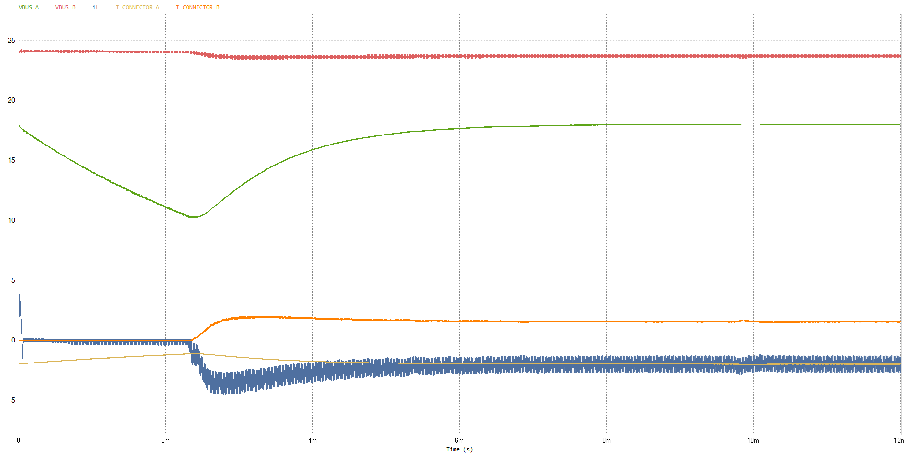

图 7 B 端向 A 端传输时的 24 V 至 18 V Buck 响应

本工况由 B 端向 A 端供能，B 端标称电压为 24 V，A 端目标电压为 18 V。曲线名称、单位及电感电流正方向与图 6 相同。A 端电压在前段下降至约 10 V，随后恢复至约 18 V；负向电感电流对应 B→A 的能量传输。因此，本图用于展示反向降压的动态过程，不能据此认定全过程已经满足稳压精度要求。

### 9.8 四路 MOSFET 栅源电压

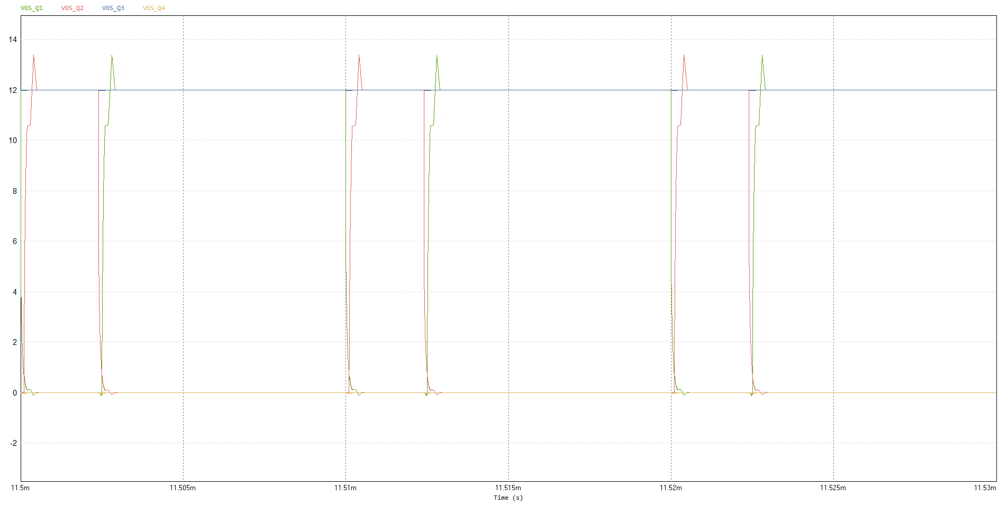

图 8 Q1 Q2 Q3 Q4 的 VGS 波形

该时间尺度可以确认四路 PWM 和栅极驱动逻辑能够工作，但不足以验证 200 ns Dead Time。后续需要在开关沿附近放大时间轴，并在实板 MOSFET 引脚处测量有效死区。

## 10 首板状态与测试计划

### 10.1 首板状态

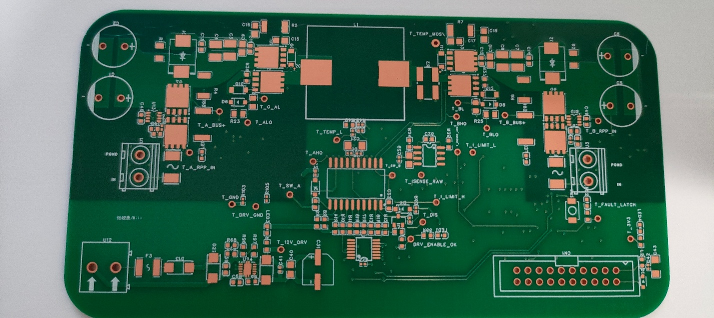

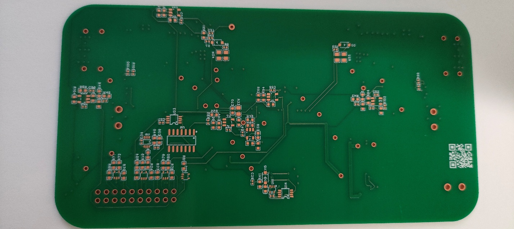

图 9 主功率板裸板正反面

同时设计了一块两层 MCU 插板，用于连接控制器与主功率板，并预留扩展控制接口和 OLED 显示接口。后续可显示功率流向、效率、故障状态和主要采样量。目前主功率板和插板均为裸板状态，尚未完成贴片和上电。

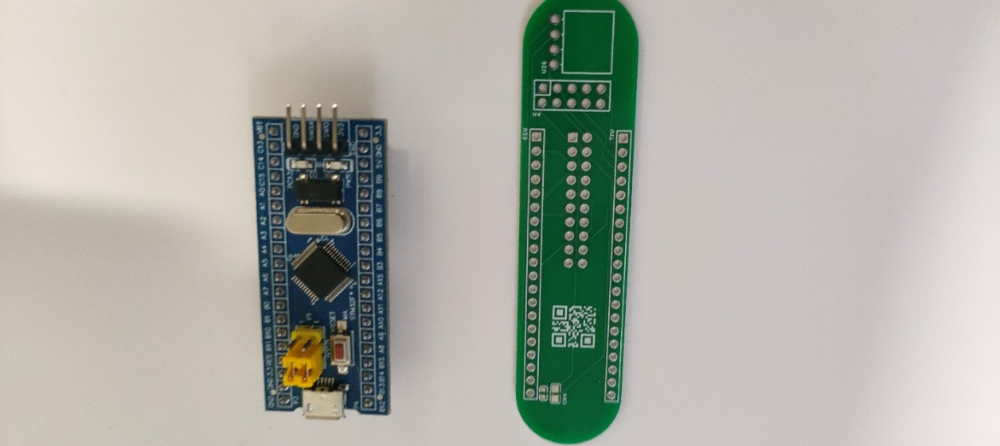

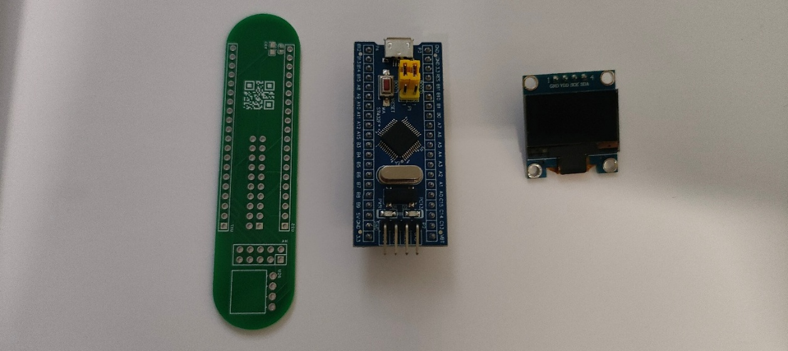

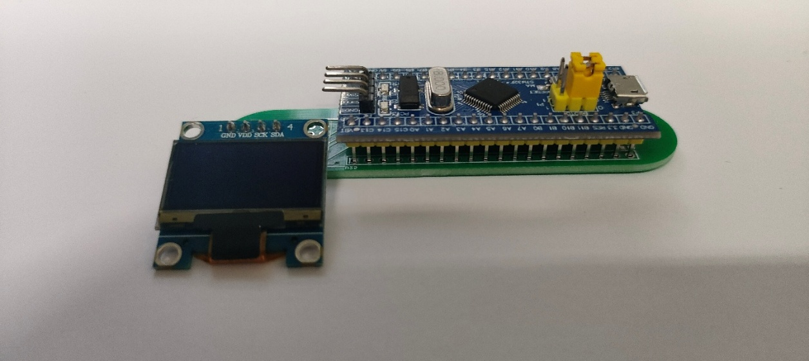

图 10 MCU 插板与 OLED 安装方式

### 10.2 首次上电顺序

1\. 断电检查：核对器件方向、焊接和端口极性，测量主要电源网络对地电阻。

2\. 仅给 3.3 V 逻辑侧限流上电，确认逻辑电源、故障锁存和复位状态，保持 PWM 禁止。

3\. 给 12 V 驱动电源限流上电，检查保险丝、TVS、TPS26620 和驱动器静态输出。

4\. 主功率母线保持断电或使用安全低压，输入 PWM，分别测量四颗 MOSFET 的 VGS、互补关系和有效死区。

5\. 使用低压限流电源和阻性负载验证 A→B 与 B→A 的 Buck、Boost 功率方向、采样极性和保护门控。

6\. 全部低压项目通过后再逐步提高电压与功率，并记录 VDS 过冲、电感电流、纹波、效率和温升。

7\. 测量 SW_A、SW_B 和高侧 VGS 时使用差分探头或等效安全测量方法，不将接地示波器的地夹直接连接到开关节点。

### 10.3 首次测量项目

- $V_{GS}$

- $V_{DS}$

- Dead Time

- SW_A / SW_B

- 电感电流

- 输出纹波

- 电流采样

• A 端与 B 端母线电压

• NOT_FAULT 与驱动使能

• 过流与过压保护动作

• 电感与 MOSFET 温度

### 10.4 Snubber 调试方法

首板保持 RC Snubber DNP。先使用低电感探测方式记录无 Snubber 时的 VDS 过冲、振铃频率和衰减，再从小电容开始试装并调整电阻，比较不同 Buck、Boost 和负载工况下的过冲、振铃、器件温升和效率，最后确定参数。

### 10.5 后续验证指标

待验证指标包括效率、输出纹波、稳压精度、负载阶跃、双向切换、CCM 与 DCM、温升以及保护动作。

上述指标尚未完成实物验证。实验条件具备后，将按统一工况记录原始波形、测试条件和计算方法，并持续更新项目结果。
